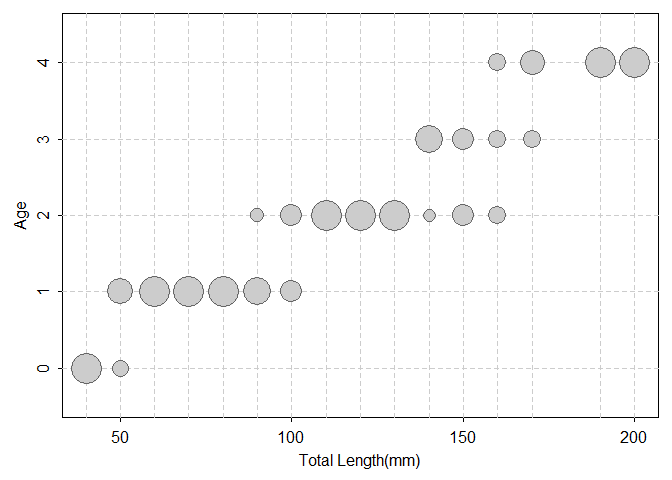

-   [必要なパッケージ](#必要なパッケージ)
-   [ALKの原理と種類](#alkの原理と種類)
    -   [ALKの原理](#alkの原理)
    -   [ALKの種類](#alkの種類)
        -   [1.The forward ALK](#the-forward-alk)
        -   [2.The inverse ALK](#the-inverse-alk)
        -   [3.The combined forward-inverse
            ALK](#the-combined-forward-inverse-alk)
-   [ALKの推定ができるRのパッケージの紹介](#alkの推定ができるrのパッケージの紹介)
    -   [**ALKr**](#alkr)
    -   [**FSA**](#fsa)
        -   [データの抽出と確認](#データの抽出と確認)
        -   [ALKの推定（割算）](#alkの推定割算)
        -   [ALKの推定（モデル）](#alkの推定モデル)
        -   [グラフィックス](#グラフィックス)
        -   [ALKの適用](#alkの適用)
    -   [**ALKr**と**FSA**の比較](#alkrとfsaの比較)

必要なパッケージ
----------------

このスクリプトで使うパッケージです。自分のPCにインストールしていない人は、以下のようにインストールしてください。
- **ALKr**:
CRANから削除されたそうで、frasyrみたいにGitHubから引っ張ってくるしかないです。開発も7年前とかに終わってて、一抹の不安を感じます。
- **FSA**: Derek
Ogleさんが作ったパッケージ。水産資源解析のある程度のことはできそう。資源動態モデルとかはほとんどない。
<a href="http://derekogle.com/IFAR/" class="uri">http://derekogle.com/IFAR/</a>
- **nnet**: 多項分布関連に必要

    devtools::install_github("zeloff/ALKr")
    devtools::install_github("droglenc/FSAdata")
    install.packages(FSA)
    install.packages(magrittr)
    install.packages(dplyr)
    install.packages(nnet)

    library(ALKr)
    library(FSA)

    ## ## FSA v0.8.30. See citation('FSA') if used in publication.
    ## ## Run fishR() for related website and fishR('IFAR') for related book.

    library(FSAdata)

    ## ## FSAdata v0.3.8.9000. See ?FSAdata to find data for specific fisheries analyses.

    library(magrittr)
    library(dplyr)

    ## 
    ## Attaching package: 'dplyr'

    ## The following objects are masked from 'package:stats':
    ## 
    ##     filter, lag

    ## The following objects are masked from 'package:base':
    ## 
    ##     intersect, setdiff, setequal, union

    library(nnet)

ALKの原理と種類
===============

ALKの原理
---------

そもそもALKとはAge-Length
Key（年齢体長相関表と日本語では言うそうです）の略称。読んで字の通り、年齢と体長の関係を表すもので、漁獲物の年齢組成を推定するのに用いられます。

一般に、

-   年齢査定は労力がかかる
-   体長測定は比較的楽（パンチングとか）

というような生物統計収集の特性から、体長を年齢に変換しようというのが始まりかと思います。

実際には2つのサンプリングルールに基づいて行われており、

-   length frequencyサンプル
-   age-lengthサンプル

とあるそうです。前者は漁獲物から一定量サンプリングして長さの組成を得るもの。
一方後者は、length
frequencyサンプルからさらにサンプリングして、年齢と体長の関係を見るもので、こちらのサンプルでは体長測定の他に年齢査定も必要とされます。

このage-lengthサンプルから得られた年齢と体長の関係(ALK)を使って、length
frequencyサンプル中の年齢組成を引き延ばし、最後に全体の漁獲量にかけることで、漁獲量の年齢組成の推定ができるという流れです。

なんでここまで苦労して年齢別漁獲量が欲しいかというと、国内資源の資源評価モデルにVPAを使っているからです。
VPAでは**真の年齢別漁獲尾数**であると仮定して、各コホートの資源計算を行います。VPAは資源の自然死亡や加入、漁獲尾数の全てが決定論的に求まるので、結果として資源量推定結果が不確実性をとらえきれていないといった弱点もあります。

せめて、ALKでうまいこと不確実性の推定ができれば、資源評価モデルにも反映させれるのではないかというのが、浜辺の個人的な興味の始まりです。（できたとして、資源動態そのものの不確実性は入っていないと言われて終わりな気もしてきました）

ALKの種類
---------

### 1.The forward ALK

age-lengthサブサンプル中の、体長階級内の年齢の比率を計算(ex.
10cm-14.9cmのサンプルは0歳:1歳:2歳=5:2:1)

=&gt; length frequencyサンプル内の個体数で引き伸ばす

### 2.The inverse ALK

age-lengthサブサンプル中の、年齢内の体長階級の比率を計算(ex.
1歳では5cm-:10cm:-15cm-=2:5:1)

その後の引き伸ばし方はいまいち分からない。（真鍋さんに聞いてください、すみません）

### 3.The combined forward-inverse ALK

forwardとinverseの重ね技。強そう。詳細は不勉強です。

ALKの推定ができるRのパッケージの紹介
====================================

**ALKr**
--------

以下に、**ALKr**の使い方とかまとまってるので、詳細知りたければこちらをご確認ください。<a href="https://www.iccat.int/GBYP/Docs/Modelling_Phase_3_R_Package_ALKr.pdf" class="uri">https://www.iccat.int/GBYP/Docs/Modelling_Phase_3_R_Package_ALKr.pdf</a>

とりあえず、**ALKr**パッケージのデータを見てみましょう。

    data(hom)
    hom$N1992

    ##       0     1    2   3   4   5   6  7  8  9  10 11 12 13 14 15
    ## 7     1     1    0   0   0   0   0  0  0  0   0  0  0  0  0  0
    ## 8     8    10    0   0   0   0   0  0  0  0   0  0  0  0  0  0
    ## 9    42    53    0   0   0   0   0  0  0  0   0  0  0  0  0  0
    ## 10  173   235    1   0   0   0   0  0  0  0   0  0  0  0  0  0
    ## 11  562   836    4   0   0   0   0  0  0  0   0  0  0  0  0  0
    ## 12 1424  2380   14   0   0   0   0  0  0  0   0  0  0  0  0  0
    ## 13 2828  5422   50   1   0   0   0  0  0  0   0  0  0  0  0  0
    ## 14 4394  9887  145   5   1   0   0  0  0  0   0  0  0  0  0  0
    ## 15 5344 14433  356  15   2   0   0  0  0  0   0  0  0  0  0  0
    ## 16 5089 16865  739  42   7   1   0  0  0  0   0  0  0  0  0  0
    ## 17 3793 15776 1293  99  18   2   0  0  0  0   0  0  0  0  0  0
    ## 18 2213 11814 1911 203  43   5   1  0  0  0   0  0  0  0  0  0
    ## 19 1011  7081 2382 364  89  13   2  1  0  0   0  0  0  0  0  0
    ## 20  361  3398 2507 567 161  28   4  2  1  0   0  0  0  0  0  0
    ## 21  101  1305 2226 769 258  53  10  4  1  1   1  0  0  0  0  0
    ## 22   22   401 1668 908 366  89  19  8  3  2   1  0  0  0  0  0
    ## 23    4    99 1055 934 457 136  33 16  6  3   3  1  0  0  0  0
    ## 24    1    19  563 836 505 186  53 27 11  7   6  1  0  0  0  0
    ## 25    0     3  254 651 493 227  77 42 19 12  12  3  1  0  0  0
    ## 26    0     0   96 442 425 248 102 60 30 20  21  5  2  1  0  0
    ## 27    0     0   31 261 323 242 121 77 43 30  35  9  4  1  0  0
    ## 28    0     0    8 134 217 212 131 91 56 42  54 14  6  2  1  0
    ## 29    0     0    2  60 129 166 128 98 68 55  78 21 10  3  1  0
    ## 30    0     0    0  23  67 117 114 96 75 65 103 29 14  4  1  0
    ## 31    0     0    0   8  31  73  92 86 77 71 126 37 20  6  2  0
    ## 32    0     0    0   2  13  41  67 70 72 72 143 43 25  7  3  1
    ## 33    0     0    0   1   5  21  45 52 61 67 151 48 30  9  3  1
    ## 34    0     0    0   0   1   9  27 35 48 57 148 49 34 10  4  1
    ## 35    0     0    0   0   0   4  15 22 35 45 134 46 35 11  5  1
    ## 36    0     0    0   0   0   1   7 12 23 33 113 41 34 11  5  2
    ## 37    0     0    0   0   0   0   3  6 14 22  88 34 31 10  5  2
    ## 38    0     0    0   0   0   0   1  3  8 13  63 26 26  9  5  2
    ## 39    0     0    0   0   0   0   0  1  4  8  42 18 21  7  4  1
    ## 40    0     0    0   0   0   0   0  0  2  4  26 12 15  6  3  1
    ## 41    0     0    0   0   0   0   0  0  1  2  15  7 10  4  2  1

シミュレーションデータらしいですが、ポルトガルの底曳網がイメージらしいです。
行が体長階級、列が年齢です。 これはlength
frequencyサンプルの結果だと思います。
これから下で、ALKとか出していくので。

各体長階級でまとめた漁獲尾数が以下のようになります。

    hom$F1992

    ##     7     8     9    10    11    12    13    14    15    16    17    18    19 
    ##     2    18    95   409  1402  3818  8301 14432 20150 22743 20981 16190 10943 
    ##    20    21    22    23    24    25    26    27    28    29    30    31    32 
    ##  7029  4729  3487  2747  2215  1794  1452  1177   968   819   708   629   559 
    ##    33    34    35    36    37    38    39    40    41 
    ##   494   423   353   282   215   156   106    69    42

    #rowSums(hom$N1992)でも同じものが得られます

`hom$otolinth`がage-lengthサブサンプルから各体長階級中の各年齢の尾数を出したものです。
実際のデータをブートストラップ法で疑似生成したシミュレーションデータみたいです。

    length(hom$otoliths)

    ## [1] 1000

    hom$otoliths[[1]]

    ##    0 1 2 3 4 5 6 7 8 9 10 11 12 13 14 15
    ## 7  1 1 0 0 0 0 0 0 0 0  0  0  0  0  0  0
    ## 8  5 5 0 0 0 0 0 0 0 0  0  0  0  0  0  0
    ## 9  5 5 0 0 0 0 0 0 0 0  0  0  0  0  0  0
    ## 10 5 5 0 0 0 0 0 0 0 0  0  0  0  0  0  0
    ## 11 6 4 0 0 0 0 0 0 0 0  0  0  0  0  0  0
    ## 12 5 5 0 0 0 0 0 0 0 0  0  0  0  0  0  0
    ## 13 4 6 0 0 0 0 0 0 0 0  0  0  0  0  0  0
    ## 14 3 7 0 0 0 0 0 0 0 0  0  0  0  0  0  0
    ## 15 5 5 0 0 0 0 0 0 0 0  0  0  0  0  0  0
    ## 16 2 8 0 0 0 0 0 0 0 0  0  0  0  0  0  0
    ## 17 3 6 1 0 0 0 0 0 0 0  0  0  0  0  0  0
    ## 18 0 9 1 0 0 0 0 0 0 0  0  0  0  0  0  0
    ## 19 1 4 4 1 0 0 0 0 0 0  0  0  0  0  0  0
    ## 20 0 5 5 0 0 0 0 0 0 0  0  0  0  0  0  0
    ## 21 0 2 5 2 1 0 0 0 0 0  0  0  0  0  0  0
    ## 22 0 2 5 2 1 0 0 0 0 0  0  0  0  0  0  0
    ## 23 0 0 3 3 2 0 2 0 0 0  0  0  0  0  0  0
    ## 24 0 0 0 4 3 2 0 1 0 0  0  0  0  0  0  0
    ## 25 0 0 2 4 3 1 0 0 0 0  0  0  0  0  0  0
    ## 26 0 0 0 3 4 2 0 0 0 1  0  0  0  0  0  0
    ## 27 0 0 0 4 4 1 0 0 1 0  0  0  0  0  0  0
    ## 28 0 0 0 1 1 5 1 2 0 0  0  0  0  0  0  0
    ## 29 0 0 0 1 1 2 0 1 0 2  3  0  0  0  0  0
    ## 30 0 0 0 0 1 1 2 1 1 2  1  0  1  0  0  0
    ## 31 0 0 0 0 0 0 1 0 4 2  2  1  0  0  0  0
    ## 32 0 0 0 0 0 0 1 5 1 1  0  1  1  0  0  0
    ## 33 0 0 0 0 0 1 0 1 3 2  2  0  1  0  0  0
    ## 34 0 0 0 0 0 0 1 0 3 0  4  2  0  0  0  0
    ## 35 0 0 0 0 0 0 0 1 2 1  4  2  0  0  0  0
    ## 36 0 0 0 0 0 0 0 0 0 0  4  2  2  1  1  0
    ## 37 0 0 0 0 0 0 0 0 2 0  4  3  0  1  0  0
    ## 38 0 0 0 0 0 0 0 0 1 0  6  0  0  1  2  0
    ## 39 0 0 0 0 0 0 0 0 0 1  4  1  4  0  0  0
    ## 40 0 0 0 0 0 0 0 0 2 1  3  2  1  1  0  0
    ## 41 0 0 0 0 0 0 0 0 0 0  3  1  3  1  1  1

どうやら、各体長階級10尾ずつ年齢査定をしたみたいです。

    rowSums(hom$otoliths[[1]])

    ##  7  8  9 10 11 12 13 14 15 16 17 18 19 20 21 22 23 24 25 26 27 28 29 30 31 32 
    ##  2 10 10 10 10 10 10 10 10 10 10 10 10 10 10 10 10 10 10 10 10 10 10 10 10 10 
    ## 33 34 35 36 37 38 39 40 41 
    ## 10 10 10 10 10 10 10 10 10

*p**j*が年齢*j*の漁獲尾数の割合
*p**i**j*が年齢*j*、体長*i*の漁獲尾数の割合
*p**j*|*i*が体長*i*中の漁獲尾の各年齢についての割合

**`classic_ALK`とすると一番基本的なALK計算がされます。**

    ALK1_1 <- classic_ALK(hom$otoliths[[1]], #各体長級の年齢査定結果 
                          hom$F1992          #各体長級のサンプリング尾数
                          )
    ALK1_1@alk

    ##      0   1   2   3   4   5   6   7   8   9  10  11  12  13  14  15
    ## 7  0.5 0.5 0.0 0.0 0.0 0.0 0.0 0.0 0.0 0.0 0.0 0.0 0.0 0.0 0.0 0.0
    ## 8  0.5 0.5 0.0 0.0 0.0 0.0 0.0 0.0 0.0 0.0 0.0 0.0 0.0 0.0 0.0 0.0
    ## 9  0.5 0.5 0.0 0.0 0.0 0.0 0.0 0.0 0.0 0.0 0.0 0.0 0.0 0.0 0.0 0.0
    ## 10 0.5 0.5 0.0 0.0 0.0 0.0 0.0 0.0 0.0 0.0 0.0 0.0 0.0 0.0 0.0 0.0
    ## 11 0.6 0.4 0.0 0.0 0.0 0.0 0.0 0.0 0.0 0.0 0.0 0.0 0.0 0.0 0.0 0.0
    ## 12 0.5 0.5 0.0 0.0 0.0 0.0 0.0 0.0 0.0 0.0 0.0 0.0 0.0 0.0 0.0 0.0
    ## 13 0.4 0.6 0.0 0.0 0.0 0.0 0.0 0.0 0.0 0.0 0.0 0.0 0.0 0.0 0.0 0.0
    ## 14 0.3 0.7 0.0 0.0 0.0 0.0 0.0 0.0 0.0 0.0 0.0 0.0 0.0 0.0 0.0 0.0
    ## 15 0.5 0.5 0.0 0.0 0.0 0.0 0.0 0.0 0.0 0.0 0.0 0.0 0.0 0.0 0.0 0.0
    ## 16 0.2 0.8 0.0 0.0 0.0 0.0 0.0 0.0 0.0 0.0 0.0 0.0 0.0 0.0 0.0 0.0
    ## 17 0.3 0.6 0.1 0.0 0.0 0.0 0.0 0.0 0.0 0.0 0.0 0.0 0.0 0.0 0.0 0.0
    ## 18 0.0 0.9 0.1 0.0 0.0 0.0 0.0 0.0 0.0 0.0 0.0 0.0 0.0 0.0 0.0 0.0
    ## 19 0.1 0.4 0.4 0.1 0.0 0.0 0.0 0.0 0.0 0.0 0.0 0.0 0.0 0.0 0.0 0.0
    ## 20 0.0 0.5 0.5 0.0 0.0 0.0 0.0 0.0 0.0 0.0 0.0 0.0 0.0 0.0 0.0 0.0
    ## 21 0.0 0.2 0.5 0.2 0.1 0.0 0.0 0.0 0.0 0.0 0.0 0.0 0.0 0.0 0.0 0.0
    ## 22 0.0 0.2 0.5 0.2 0.1 0.0 0.0 0.0 0.0 0.0 0.0 0.0 0.0 0.0 0.0 0.0
    ## 23 0.0 0.0 0.3 0.3 0.2 0.0 0.2 0.0 0.0 0.0 0.0 0.0 0.0 0.0 0.0 0.0
    ## 24 0.0 0.0 0.0 0.4 0.3 0.2 0.0 0.1 0.0 0.0 0.0 0.0 0.0 0.0 0.0 0.0
    ## 25 0.0 0.0 0.2 0.4 0.3 0.1 0.0 0.0 0.0 0.0 0.0 0.0 0.0 0.0 0.0 0.0
    ## 26 0.0 0.0 0.0 0.3 0.4 0.2 0.0 0.0 0.0 0.1 0.0 0.0 0.0 0.0 0.0 0.0
    ## 27 0.0 0.0 0.0 0.4 0.4 0.1 0.0 0.0 0.1 0.0 0.0 0.0 0.0 0.0 0.0 0.0
    ## 28 0.0 0.0 0.0 0.1 0.1 0.5 0.1 0.2 0.0 0.0 0.0 0.0 0.0 0.0 0.0 0.0
    ## 29 0.0 0.0 0.0 0.1 0.1 0.2 0.0 0.1 0.0 0.2 0.3 0.0 0.0 0.0 0.0 0.0
    ## 30 0.0 0.0 0.0 0.0 0.1 0.1 0.2 0.1 0.1 0.2 0.1 0.0 0.1 0.0 0.0 0.0
    ## 31 0.0 0.0 0.0 0.0 0.0 0.0 0.1 0.0 0.4 0.2 0.2 0.1 0.0 0.0 0.0 0.0
    ## 32 0.0 0.0 0.0 0.0 0.0 0.0 0.1 0.5 0.1 0.1 0.0 0.1 0.1 0.0 0.0 0.0
    ## 33 0.0 0.0 0.0 0.0 0.0 0.1 0.0 0.1 0.3 0.2 0.2 0.0 0.1 0.0 0.0 0.0
    ## 34 0.0 0.0 0.0 0.0 0.0 0.0 0.1 0.0 0.3 0.0 0.4 0.2 0.0 0.0 0.0 0.0
    ## 35 0.0 0.0 0.0 0.0 0.0 0.0 0.0 0.1 0.2 0.1 0.4 0.2 0.0 0.0 0.0 0.0
    ## 36 0.0 0.0 0.0 0.0 0.0 0.0 0.0 0.0 0.0 0.0 0.4 0.2 0.2 0.1 0.1 0.0
    ## 37 0.0 0.0 0.0 0.0 0.0 0.0 0.0 0.0 0.2 0.0 0.4 0.3 0.0 0.1 0.0 0.0
    ## 38 0.0 0.0 0.0 0.0 0.0 0.0 0.0 0.0 0.1 0.0 0.6 0.0 0.0 0.1 0.2 0.0
    ## 39 0.0 0.0 0.0 0.0 0.0 0.0 0.0 0.0 0.0 0.1 0.4 0.1 0.4 0.0 0.0 0.0
    ## 40 0.0 0.0 0.0 0.0 0.0 0.0 0.0 0.0 0.2 0.1 0.3 0.2 0.1 0.1 0.0 0.0
    ## 41 0.0 0.0 0.0 0.0 0.0 0.0 0.0 0.0 0.0 0.0 0.3 0.1 0.3 0.1 0.1 0.1

例として、体長クラス19の結果を見ると、

    knitr::kable(rbind(otolinths = as.numeric(hom$otoliths[[1]][30,]),
                       ALK = as.numeric(ALK1_1@alk[30,])))

    ## Warning in kable_pipe(x = structure(c("otolinths", "ALK", "0", "0", "0", : The
    ## table should have a header (column names)

<table>
<tbody>
<tr class="odd">
<td style="text-align: left;">otolinths</td>
<td style="text-align: right;">0</td>
<td style="text-align: right;">0</td>
<td style="text-align: right;">0</td>
<td style="text-align: right;">0</td>
<td style="text-align: right;">0</td>
<td style="text-align: right;">0</td>
<td style="text-align: right;">0</td>
<td style="text-align: right;">0</td>
<td style="text-align: right;">0</td>
<td style="text-align: right;">0</td>
<td style="text-align: right;">4.0</td>
<td style="text-align: right;">2.0</td>
<td style="text-align: right;">2.0</td>
<td style="text-align: right;">1.0</td>
<td style="text-align: right;">1.0</td>
<td style="text-align: right;">0</td>
</tr>
<tr class="even">
<td style="text-align: left;">ALK</td>
<td style="text-align: right;">0</td>
<td style="text-align: right;">0</td>
<td style="text-align: right;">0</td>
<td style="text-align: right;">0</td>
<td style="text-align: right;">0</td>
<td style="text-align: right;">0</td>
<td style="text-align: right;">0</td>
<td style="text-align: right;">0</td>
<td style="text-align: right;">0</td>
<td style="text-align: right;">0</td>
<td style="text-align: right;">0.4</td>
<td style="text-align: right;">0.2</td>
<td style="text-align: right;">0.2</td>
<td style="text-align: right;">0.1</td>
<td style="text-align: right;">0.1</td>
<td style="text-align: right;">0</td>
</tr>
</tbody>
</table>

-   otolinthsは実際に年齢査定した尾数
-   ALKは各体長年休ごとの割合

といった感じになっております。

この結果を`summary`すると各年齢の割合が計算されます

    summary(ALK1_1)

    ##              pj  mean_lj    var_lj
    ## 0  2.179178e-01 15.00245  3.145121
    ## 1  5.520904e-01 16.24812  4.352743
    ## 2  1.127132e-01 19.77564  3.231483
    ## 3  4.168662e-02 22.92327  6.804678
    ## 4  2.584313e-02 24.43053  4.832838
    ## 5  1.199517e-02 26.63425  4.620335
    ## 6  6.328726e-03 26.10549 14.627888
    ## 7  6.216010e-03 29.01888 11.136675
    ## 8  6.096626e-03 32.05590  7.970945
    ## 9  5.228252e-03 30.16622  7.827305
    ## 10 8.134170e-03 33.53731 11.096189
    ## 11 2.824550e-03 34.57048  5.895539
    ## 12 1.963512e-03 34.03397 12.085832
    ## 13 5.095528e-04 37.32592  2.162316
    ## 14 4.241827e-04 37.31132  1.896628
    ## 15 2.801206e-05 41.00000       NaN
    ## 
    ## Method: Classic ALK

**FSA**
-------

Ogleが開発したパッケージで、この中でもALKの計算が可能。
パッケージ内のデータもtidy型式で、リスト中心な**ALKr**よりも使いやすい印象。
本もあって、説明も丁寧なせいか、こっちの方がしっくり来てます。

### データの抽出と確認

データは**FSAdata**パッケージに入っている。

    data(CreekChub)
    head(CreekChub)

    ##   len age
    ## 1  41   0
    ## 2  42   0
    ## 3  42   0
    ## 4  42   0
    ## 5  43   0
    ## 6  44   0

    tail(CreekChub)

    ##     len age
    ## 213 106  NA
    ## 214 108  NA
    ## 215 109  NA
    ## 216 109  NA
    ## 217 109  NA
    ## 218 109  NA

    CreekChub$age

    ##   [1]  0  0  0  0  0  0  0  0  0  0  0  0  0  1  1  1  1  1  1  1  1  1  1  1  1
    ##  [26]  1  1  1  1  1  1  1  1  1  1  1  1  1  1  1  1  1  1  1  1  1  1  1  1  1
    ##  [51]  1  1  1  1  1  1  1  1  1  1  1  2  2  2  2  2  2  2  2  2  2  2  2  2  2
    ##  [76]  2  2  2  2  2  2  2  2  2  2  2  2  2  2  2  3  3  3  3  3  3  3  3  4  4
    ## [101]  4  4  4 NA NA NA NA NA NA NA NA NA NA NA NA NA NA NA NA NA NA NA NA NA NA
    ## [126] NA NA NA NA NA NA NA NA NA NA NA NA NA NA NA NA NA NA NA NA NA NA NA NA NA
    ## [151] NA NA NA NA NA NA NA NA NA NA NA NA NA NA NA NA NA NA NA NA NA NA NA NA NA
    ## [176] NA NA NA NA NA NA NA NA NA NA NA NA NA NA NA NA NA NA NA NA NA NA NA NA NA
    ## [201] NA NA NA NA NA NA NA NA NA NA NA NA NA NA NA NA NA NA

この`CreekChub`データには漁獲物から一回目のサンプルをして魚体長測定だけしたデータ（`$age`がNAになっている箇所）と
さらにサブサンプルとして年齢査定を行ったものが混ざっている。

10㎝刻みのビンにしていきたい場合は以下のようにすると、

    CreekChub %<>% mutate(lcat10 = lencat(len, w=10))
    head(CreekChub)

    ##   len age lcat10
    ## 1  41   0     40
    ## 2  42   0     40
    ## 3  42   0     40
    ## 4  42   0     40
    ## 5  43   0     40
    ## 6  44   0     40

    tail(CreekChub)

    ##     len age lcat10
    ## 213 106  NA    100
    ## 214 108  NA    100
    ## 215 109  NA    100
    ## 216 109  NA    100
    ## 217 109  NA    100
    ## 218 109  NA    100

    table(CreekChub$lcat10)

    ## 
    ##  40  50  60  70  80  90 100 110 120 130 140 150 160 170 190 200 
    ##  11  33  42  32   8  25  32  10   6   3   6   2   3   3   1   1

魚体長のみ記録されたサンプル（length frequency
sample）と、年齢査定がされているサブサンプル（age-length
sample）にオブジェクトを分けると、

    sample1 <- filter(CreekChub, is.na(age))
    sample1$age

    ##   [1] NA NA NA NA NA NA NA NA NA NA NA NA NA NA NA NA NA NA NA NA NA NA NA NA NA
    ##  [26] NA NA NA NA NA NA NA NA NA NA NA NA NA NA NA NA NA NA NA NA NA NA NA NA NA
    ##  [51] NA NA NA NA NA NA NA NA NA NA NA NA NA NA NA NA NA NA NA NA NA NA NA NA NA
    ##  [76] NA NA NA NA NA NA NA NA NA NA NA NA NA NA NA NA NA NA NA NA NA NA NA NA NA
    ## [101] NA NA NA NA NA NA NA NA NA NA NA NA NA NA NA

    sample2 <- filter(CreekChub, !is.na(age))
    sample2$age

    ##   [1] 0 0 0 0 0 0 0 0 0 0 0 0 0 1 1 1 1 1 1 1 1 1 1 1 1 1 1 1 1 1 1 1 1 1 1 1 1
    ##  [38] 1 1 1 1 1 1 1 1 1 1 1 1 1 1 1 1 1 1 1 1 1 1 1 1 2 2 2 2 2 2 2 2 2 2 2 2 2
    ##  [75] 2 2 2 2 2 2 2 2 2 2 2 2 2 2 2 2 3 3 3 3 3 3 3 3 4 4 4 4 4

### ALKの推定（割算）

まずは単純にage-length
sample(`sample2`)で各魚体長階級内の各年齢の観測尾数を見る。

    (alk_freq <- xtabs(~lcat10 + age, data = sample2))

    ##       age
    ## lcat10  0  1  2  3  4
    ##    40  10  0  0  0  0
    ##    50   3  7  0  0  0
    ##    60   0 10  0  0  0
    ##    70   0 10  0  0  0
    ##    80   0  8  0  0  0
    ##    90   0  8  2  0  0
    ##    100  0  5  5  0  0
    ##    110  0  0 10  0  0
    ##    120  0  0  6  0  0
    ##    130  0  0  3  0  0
    ##    140  0  0  1  5  0
    ##    150  0  0  1  1  0
    ##    160  0  0  1  1  1
    ##    170  0  0  0  1  2
    ##    190  0  0  0  0  1
    ##    200  0  0  0  0  1

これを割合に変換してみたいなら`prop.table`という関数があるらしい。

    alk <- prop.table(alk_freq, margin = 1)
    round(alk, 2)

    ##       age
    ## lcat10    0    1    2    3    4
    ##    40  1.00 0.00 0.00 0.00 0.00
    ##    50  0.30 0.70 0.00 0.00 0.00
    ##    60  0.00 1.00 0.00 0.00 0.00
    ##    70  0.00 1.00 0.00 0.00 0.00
    ##    80  0.00 1.00 0.00 0.00 0.00
    ##    90  0.00 0.80 0.20 0.00 0.00
    ##    100 0.00 0.50 0.50 0.00 0.00
    ##    110 0.00 0.00 1.00 0.00 0.00
    ##    120 0.00 0.00 1.00 0.00 0.00
    ##    130 0.00 0.00 1.00 0.00 0.00
    ##    140 0.00 0.00 0.17 0.83 0.00
    ##    150 0.00 0.00 0.50 0.50 0.00
    ##    160 0.00 0.00 0.33 0.33 0.33
    ##    170 0.00 0.00 0.00 0.33 0.67
    ##    190 0.00 0.00 0.00 0.00 1.00
    ##    200 0.00 0.00 0.00 0.00 1.00

### ALKの推定（モデル）

先の観測値の割り算ALKには問題点が大きく2つある

-   体長階級内での年齢の変動が大きいことと、その中でのサンプル数が少ないことから、奇妙な年齢内体長組成が生じることがある（きれいな山形にならない）
-   体長階級内に観測値がない（150cmでどの年齢も個体数0とか）

解決法の一つとして多項ロジスティック回帰モデルを使う例がある。
（二項ロジスティックモデルの拡張版）

**nnet**パッケージの`multinom`関数を使うと多項ロジスティック回帰モデルが使える。

    res_mlr <- multinom(age ~ lcat10, data = sample2, maxit = 500)

    ## # weights:  15 (8 variable)
    ## initial  value 165.772105 
    ## iter  10 value 87.495947
    ## iter  20 value 34.649734
    ## iter  30 value 33.619180
    ## iter  40 value 33.449524
    ## iter  50 value 33.338196
    ## iter  60 value 33.334369
    ## iter  70 value 33.295000
    ## iter  80 value 33.287968
    ## iter  90 value 33.269580
    ## iter 100 value 33.265739
    ## iter 110 value 33.260361
    ## iter 120 value 33.256740
    ## iter 130 value 33.255749
    ## iter 140 value 33.253324
    ## iter 150 value 33.251513
    ## iter 160 value 33.250065
    ## iter 170 value 33.249354
    ## iter 180 value 33.247637
    ## iter 180 value 33.247637
    ## final  value 33.247632 
    ## converged

あとはCPUE標準化とかと同じく、この結果から予測値を出すと。
予測値を出す関数は`predict`で、予測のために体長区分だけ決めておいてあげないといけない。

    length_tmp <- seq(40, 200, 10)
    alk_mlr <- predict(res_mlr, 
                       data.frame(lcat10 = length_tmp),
                       type = "probs")
    row.names(alk_mlr) <- length_tmp
    round(alk_mlr, 2)

    ##       0    1    2    3    4
    ## 40  1.0 0.00 0.00 0.00 0.00
    ## 50  0.3 0.70 0.00 0.00 0.00
    ## 60  0.0 1.00 0.00 0.00 0.00
    ## 70  0.0 1.00 0.00 0.00 0.00
    ## 80  0.0 0.99 0.01 0.00 0.00
    ## 90  0.0 0.87 0.13 0.00 0.00
    ## 100 0.0 0.38 0.61 0.00 0.00
    ## 110 0.0 0.05 0.93 0.02 0.00
    ## 120 0.0 0.00 0.93 0.06 0.00
    ## 130 0.0 0.00 0.81 0.19 0.00
    ## 140 0.0 0.00 0.56 0.43 0.00
    ## 150 0.0 0.00 0.27 0.69 0.04
    ## 160 0.0 0.00 0.08 0.67 0.26
    ## 170 0.0 0.00 0.01 0.28 0.71
    ## 180 0.0 0.00 0.00 0.05 0.94
    ## 190 0.0 0.00 0.00 0.01 0.99
    ## 200 0.0 0.00 0.00 0.00 1.00

80cm以降、観測値の割り算と値が変わっていて、少しスムージングされたことがわかる。
スムージングされている方が、らしいなと感じでしまうのは人の性でしょうか。

### グラフィックス

作図関数まであるのは親切設計だなと思いました。はい。

`type`引数でいろいろ図示方法を設定できるみたいです。

    alkPlot(alk, type = "area", pal = "gray", showLegend = TRUE,
            leg.cex = .7, xlab = "Total Length(mm)")

せっかくなのでバブルプロットでスムージング有無の結果を比較してみましょう

    alkPlot(alk, type = "bubble", xlab = "Total Length(mm)")

    alkPlot(alk_mlr, type = "bubble", xlab = "Total Length(mm)")

### ALKの適用

得られたALKを使って、length frequencyサンプルに引き伸ばしていく手順。
目標は漁獲物内の年齢組成を出すことだから！

    (length_n <- xtabs(~lcat10, data = CreekChub))

    ## lcat10
    ##  40  50  60  70  80  90 100 110 120 130 140 150 160 170 190 200 
    ##  11  33  42  32   8  25  32  10   6   3   6   2   3   3   1   1

    (tmp <- sweep(alk, MARGIN = 1, FUN = "*", STATS = length_n))

    ##       age
    ## lcat10    0    1    2    3    4
    ##    40  11.0  0.0  0.0  0.0  0.0
    ##    50   9.9 23.1  0.0  0.0  0.0
    ##    60   0.0 42.0  0.0  0.0  0.0
    ##    70   0.0 32.0  0.0  0.0  0.0
    ##    80   0.0  8.0  0.0  0.0  0.0
    ##    90   0.0 20.0  5.0  0.0  0.0
    ##    100  0.0 16.0 16.0  0.0  0.0
    ##    110  0.0  0.0 10.0  0.0  0.0
    ##    120  0.0  0.0  6.0  0.0  0.0
    ##    130  0.0  0.0  3.0  0.0  0.0
    ##    140  0.0  0.0  1.0  5.0  0.0
    ##    150  0.0  0.0  1.0  1.0  0.0
    ##    160  0.0  0.0  1.0  1.0  1.0
    ##    170  0.0  0.0  0.0  1.0  2.0
    ##    190  0.0  0.0  0.0  0.0  1.0
    ##    200  0.0  0.0  0.0  0.0  1.0

最後に、ALKをlength
frequencyサンプルの体長組成データにかけたものを、年齢に対して足し合わせれば、各年齢の個体数頻度が出てくる。

    (ad1 <- colSums(tmp))

    ##     0     1     2     3     4 
    ##  20.9 141.1  43.0   8.0   5.0

    round(prop.table(ad1), 3)

    ##     0     1     2     3     4 
    ## 0.096 0.647 0.197 0.037 0.023

と手計算でもできるけど、`alkAgeDist`関数を使えば、一発で出る。

    alkAgeDist(alk, lenA.n = rowSums(alk_freq), len.n = length_n)

    ##   age       prop          se
    ## 1   0 0.09587156 0.028037207
    ## 2   1 0.64724771 0.044703252
    ## 3   2 0.19724771 0.036408292
    ## 4   3 0.03669725 0.013789774
    ## 5   4 0.02293578 0.008754956

**ALKr**と**FSA**の比較
-----------------------

**ALKr**パッケージのデータがいまいちわからなかったので、**FSA**の`CreekChub`データで最後の各年齢の割合と標準偏差を比較しよう

としたけど、このデータの型だと**ALKr**に適用できなかったので、**ALKr**のデータを**FSA**の`alkAgeDist`に当てはめてみた

 ちなみにCreek
Chubはまさかの淡水魚。コイの仲間で、カワムツとかアブラハヤに似てますね。北米固有属っぽいです。

    alkAgeDist(ALK1_1@alk,
               lenA.n = rowSums(hom$otoliths[[1]]),
               len.n = hom$F1992)

    ##    age         prop           se
    ## 1    0 2.179209e-01 4.170815e-02
    ## 2    1 5.520899e-01 4.581233e-02
    ## 3    2 1.127120e-01 2.384790e-02
    ## 4    3 4.168617e-02 1.013139e-02
    ## 5    4 2.584285e-02 5.905795e-03
    ## 6    5 1.199504e-02 3.103905e-03
    ## 7    6 6.328658e-03 2.679943e-03
    ## 8    7 6.215944e-03 2.001127e-03
    ## 9    8 6.096561e-03 1.430511e-03
    ## 10   9 5.228196e-03 1.605518e-03
    ## 11  10 8.134083e-03 1.414601e-03
    ## 12  11 2.824520e-03 8.239163e-04
    ## 13  12 1.963491e-03 7.435697e-04
    ## 14  13 5.095473e-04 2.645771e-04
    ## 15  14 4.241782e-04 2.362699e-04
    ## 16  15 2.801176e-05 2.834318e-05

    (summary(ALK1_1))

    ##              pj  mean_lj    var_lj
    ## 0  2.179178e-01 15.00245  3.145121
    ## 1  5.520904e-01 16.24812  4.352743
    ## 2  1.127132e-01 19.77564  3.231483
    ## 3  4.168662e-02 22.92327  6.804678
    ## 4  2.584313e-02 24.43053  4.832838
    ## 5  1.199517e-02 26.63425  4.620335
    ## 6  6.328726e-03 26.10549 14.627888
    ## 7  6.216010e-03 29.01888 11.136675
    ## 8  6.096626e-03 32.05590  7.970945
    ## 9  5.228252e-03 30.16622  7.827305
    ## 10 8.134170e-03 33.53731 11.096189
    ## 11 2.824550e-03 34.57048  5.895539
    ## 12 1.963512e-03 34.03397 12.085832
    ## 13 5.095528e-04 37.32592  2.162316
    ## 14 4.241827e-04 37.31132  1.896628
    ## 15 2.801206e-05 41.00000       NaN
    ## 
    ## Method: Classic ALK

こんな感じで各年齢の割合*p**j*の平均値はほとんど同じ結果となった
