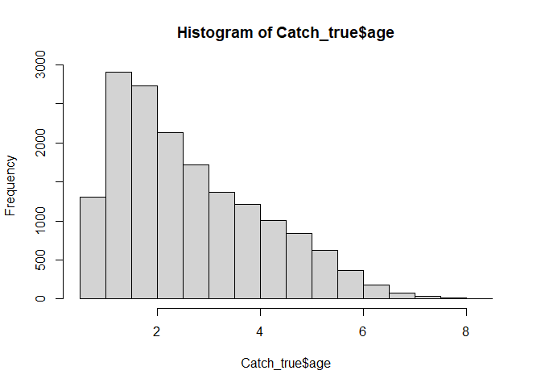
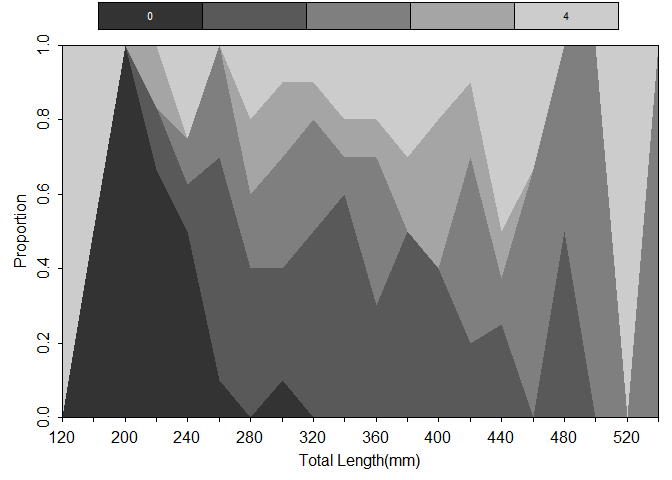
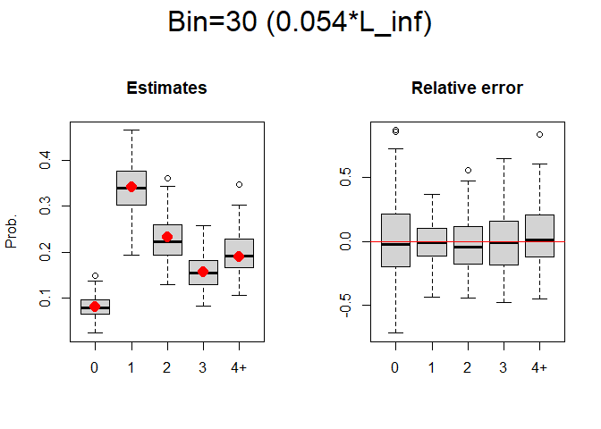
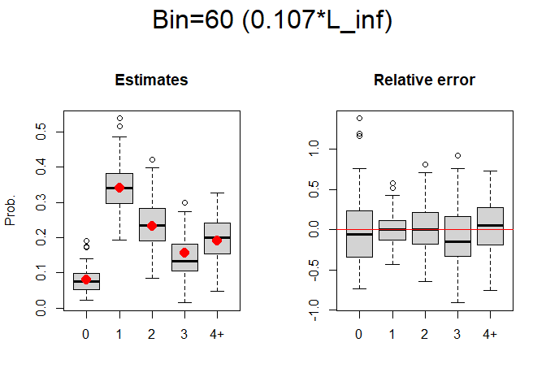
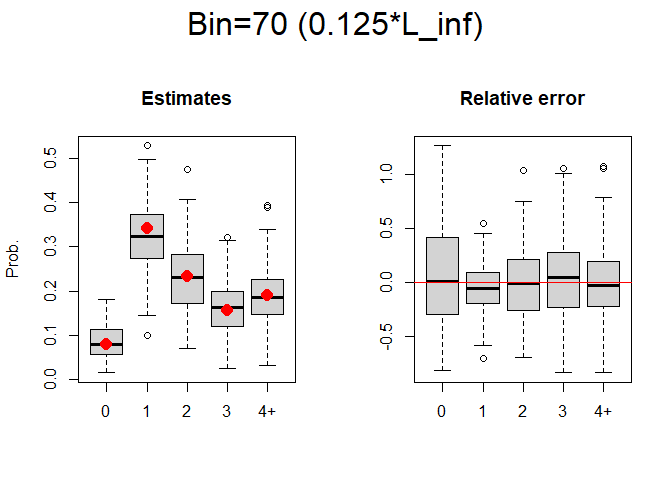
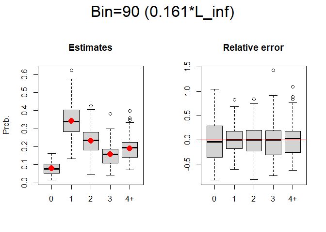

-   [目的](#目的)
-   [解析の流れ](#解析の流れ)
-   [成長モデル（von Bertalanffy）](#成長モデルvon-bertalanffy)
    -   [最大ビン幅と年齢+グループの設定](#最大ビン幅と年齢グループの設定)
-   [シミュレーション1回の流れ](#シミュレーション1回の流れ)
    -   [資源集団の生成と体長データの生成](#資源集団の生成と体長データの生成)
    -   [漁獲物の抽出](#漁獲物の抽出)
    -   [Length
        frequencyサンプルの抽出](#length-frequencyサンプルの抽出)
    -   [Age-lengthサブサンプルの抽出](#age-lengthサブサンプルの抽出)
    -   [ALKの計算](#alkの計算)
-   [ビン幅を変えての計算とその結果](#ビン幅を変えての計算とその結果)
    -   [結果](#結果)
-   [メモ](#メモ)

目的
====

-   ALKを得る際に、どのくらいの体長ビン幅が推定上最適なのか知ること
    -   (正直、細かければ細かいほうがいいという辺りだとは思う)
    -   例えばCV10%で推定結果を得るには?みたいにするのがベターかな
-   成長関数の各パラメータの値と最適ビン幅の関係の把握
    -   L\_infの10%体長とかそんな風に得られたら面白いかな

解析の流れ
==========

1.  5万匹くらいの資源の全体を設定

2.  年齢データがあるから、体長に変換する

3.  体長についての選択曲線から漁獲物を抽出(上手いアイデアなかったのでとりあえず300-500mmをランダム抽出)

4.  1万匹の漁獲サンプルからlength frequencyサンプル200を抽出

5.  さらに各体長ビンから10尾ずつ年齢査定をしてALKの計算

6.  4と5を繰り返してシミュレーション

成長モデル（von Bertalanffy）
=============================

トラフグ瀬戸内系群を参考にしてみた。

雌雄差が少なさそうなので、資源評価書の値を雄雌それぞれほどほどに見て扱った

    L_inf_true <- 560
    K_true <- 0.6
    a0_true <- -0.144
    VB <- function(x, L_inf=L_inf_true, K=K_true, a0=a0_true, 
                   a_sd=0.05, b_sd=0.1, deterministic = FALSE){
      if(isTRUE(deterministic)){
        L_inf*(1-exp(-K*(x-a0)))
      } else {
        sd <- a_sd + b_sd*x
        L_inf*(1-exp(-K*(x-a0)))*exp(rnorm(1, -.5*sd^2, sd))
      }
    }

    curve(VB(x, deterministic = TRUE), xlim = c(0,5), ylim = c(0,1000),
          ylab = "Length (mm)", xlab = "Age", lwd = 3)
    for(i in 1:100){
      points(1,VB(1))
      points(2,VB(2))
      points(3,VB(3))
      points(4,VB(4))
      points(5,VB(5))
    }

分散に線形構造加えると、対数正規の補正ずれる
**あとでチェック**

#### 最大ビン幅と年齢+グループの設定

    max_length <-700
    max_age <-4

シミュレーション1回の流れ
=========================

資源集団の生成と体長データの生成
--------------------------------

-   なんだが漁獲組成から反映させてしまった
-   適当に指数減少的にしてもいいのかも

<!-- -->

    CAA_true <- c(5000,2500,2500,2300,2000)*5 # 2016年のCAA
    age1_dist <- rnorm(CAA_true[1])+1     # 1歳魚の乱数
    age2_dist <- rnorm(CAA_true[2])+2     # 2歳魚の乱数
    age3_dist <- rnorm(CAA_true[3])+3     # 3歳魚の乱数
    age4_dist <- rnorm(CAA_true[4])+4     # 4歳魚の乱数
    age5_dist <- rnorm(CAA_true[5])+5     # 5歳魚の乱数

    age_vec_true <- c(age1_dist, age2_dist, age3_dist, age4_dist, age5_dist)
    age_vec_true <- age_vec_true[-which(age_vec_true <= 0.5)]

    CAAprob_true <- floor(age_vec_true) %>% table() %>% prop.table() %>% round(digits = 3)

    Sample_true <- data.frame(id = 1:length(age_vec_true), 
                             age = age_vec_true,
                             length = purrr::map(age_vec_true, VB) %>% unlist())

漁獲物の抽出
------------

1.  選択曲線にはダブルロジスティック関数を仮定（延縄なので）

2.  先の資源集団の体長組成にダブルロジスティック関数を当てはめて、各体長の選択率を算出

3.  その選択率をもとに、ベルヌーイ分布で生成

-   0: 漁獲せず
-   1: 漁獲される

<!-- -->

    # double logistic function for selectivity
    double_norm <- function(x, b1=300, b2=0.02, b3=400, b4=0.02){
      (1/(1+exp(-b2*(x-b1)))*(1-(1/(1+exp(-b4*(x-b3))))))/1
    }
    curve(double_norm(x), xlim = c(0,700), ylim=c(0,1))

    # 各体長の選択率に従って、ベルヌーイ分布で0、１で返す
    rBern <- function(ss)sample(x = c(0,1), size = 1, prob = c((1-ss),ss))

    length_tmp2 <- double_norm(Sample_true$length)
    C_0or1 <- numeric()
    for (i in 1:length(length_tmp2)) {
      C_0or1[i] <- rBern(length_tmp2[i])
    }
    Catch_true <- Sample_true[which(C_0or1==1),]

    hist(Catch_true$age)

    prob_Catch_true <- Catch_true$age %>% floor() %>% table()%>% prop.table()
    c(prob_Catch_true[1:4], sum(prob_Catch_true[5:9]))

    ##          0          1          2          3            
    ## 0.08329825 0.33974860 0.23377639 0.15522945 0.18794731

Length frequencyサンプルの抽出
------------------------------

    n_sample1 <- 200
    sample1_true <- sample(1:length(Catch_true$id), n_sample1)

    LF_mat_true <- data.frame(id = Catch_true$id[sample1_true],
                              age = Catch_true$age[sample1_true],
                              length = Catch_true$length[sample1_true]
                              )
    LF_mat_true %<>% mutate(bin_L = lencat(length, w=20))
    LF_mat_true$bin_L[(LF_mat_true$bin_L>=max_length)] <- max_length
    head(LF_mat_true)

    ##      id      age   length bin_L
    ## 1 20952 1.269209 317.2955   300
    ## 2 18343 1.854035 317.8650   300
    ## 3 52144 4.406723 408.0459   400
    ## 4 34490 3.019120 380.6883   380
    ## 5 35063 3.457719 384.7201   380
    ## 6 43480 4.194551 379.8247   360

Age-lengthサブサンプルの抽出
----------------------------

各体長幅ビンから10尾ずつ年齢査定してるんだけど、これって細かいほうが自ずと有利だよね

年齢査定の総尾数は固定したほうがいい？？

目的あってのシミュレーションなわけだし、実際の現場に即している方法を真鍋さんに伺う

    id_tmp <- age_tmp <- length_tmp <- bin_tmp <- NA
    bL_list <- unique(LF_mat_true$bin_L) %>% sort()
    for(bL in 1:length(bL_list)){
      subset_data <- LF_mat_true[LF_mat_true$bin_L==bL_list[bL],]
      if(length(subset_data[,1]) >= 10){
        sample2_label <- sample(1:length(subset_data[,1]), 10) %>% sort()
        id_tmp <- c(id_tmp, subset_data$id[sample2_label])    
        age_tmp <- c(age_tmp, floor(subset_data$age[sample2_label]))
        length_tmp <- c(length_tmp, subset_data$length[sample2_label])
        bin_tmp <- c(bin_tmp, subset_data$bin_L[sample2_label])
      } else {
        id_tmp <- c(id_tmp, subset_data$id)    
        age_tmp <- c(age_tmp, floor(subset_data$age))
        length_tmp <- c(length_tmp, subset_data$length)
        bin_tmp <- c(bin_tmp, subset_data$bin_L)
      }
    }

    plus_tmp <- cbind(age_tmp, rep(NA, length(age_tmp)))
    for (i in 2:length(age_tmp)) {
      plus_tmp[i,2] <- if(plus_tmp[i,1]>=max_age)max_age else plus_tmp[i,1]
    }
    AL_mat <- data.frame(id = na.omit(id_tmp),
                         age = na.omit(plus_tmp[,2]),
                         length = na.omit(length_tmp),
                         bin_L = na.omit(bin_tmp))

    table(AL_mat$bin_L)

    ## 
    ## 180 200 220 240 260 280 300 320 340 360 380 400 420 440 460 480 500 520 560 
    ##   3   4   6   8  10  10  10  10  10  10  10  10  10   9   2   2   3   2   2

ALKの計算
---------

    ALK_freq <- xtabs(~bin_L + age, data = AL_mat)
    ALK_est <- prop.table(ALK_freq, margin = 1)
    alkPlot(ALK_est, type = "area", pal = "gray", showLegend = TRUE,
            leg.cex = .7, xlab = "Total Length(mm)")

    alkPlot(ALK_est, type = "bubble", pal = "gray", showLegend = TRUE,
            leg.cex = .7, xlab = "Total Length(mm)")

    length_n <- xtabs(~bin_L, data = LF_mat_true)
    alkAgeDist(ALK_est, lenA.n = rowSums(ALK_freq), len.n = length_n)

    ##   age   prop         se
    ## 1   0 0.0680 0.01933875
    ## 2   1 0.3385 0.04546710
    ## 3   2 0.2350 0.04190941
    ## 4   3 0.1685 0.03671508
    ## 5   4 0.1900 0.03669506

ざっとこんな感じです

ビン幅を変えての計算とその結果
==============================

    bin_sim <- seq(10,100,10)
    iteration <- 100
    n_sample1 <- 200
    res_ALKest <- res_ALKse <- LF_mat_sim <- AL_mat_sim <- list()
    est_mat <- se_mat <- matrix(NA, ncol = 5, nrow = iteration)

    for(bb in 1:length(bin_sim)){
      for (ite in 1:iteration) {
        sample1_true <- sample(1:length(Catch_true$id), n_sample1)
      
        ## length frequency sample ----------------------------- ##
        LF_mat_true <- data.frame(id = Catch_true$id[sample1_true],
                                  age = Catch_true$age[sample1_true],
                                  length = Catch_true$length[sample1_true]
        )
        LF_mat_true %<>% mutate(bin_L = lencat(length, w=bin_sim[bb]))
        LF_mat_true$bin_L[(LF_mat_true$bin_L>=max_length)] <- max_length
        
        ## age-length sample ----------------------------- ##
        id_tmp <- age_tmp <- length_tmp <- bin_tmp <- NA
        bL_list <- unique(LF_mat_true$bin_L) %>% sort()
        for(bL in 1:length(bL_list)){
          subset_data <- LF_mat_true[LF_mat_true$bin_L==bL_list[bL],]
          if(length(subset_data[,1]) >= 10){
            sample2_label <- sample(1:length(subset_data[,1]), 10) %>% sort()
            id_tmp <- c(id_tmp, subset_data$id[sample2_label])    
            age_tmp <- c(age_tmp, floor(subset_data$age[sample2_label]))
            length_tmp <- c(length_tmp, subset_data$length[sample2_label])
            bin_tmp <- c(bin_tmp, subset_data$bin_L[sample2_label])
          } else {
            id_tmp <- c(id_tmp, subset_data$id)    
            age_tmp <- c(age_tmp, floor(subset_data$age))
            length_tmp <- c(length_tmp, subset_data$length)
            bin_tmp <- c(bin_tmp, subset_data$bin_L)
          }
        }
        plus_tmp <- cbind(age_tmp, rep(NA, length(age_tmp)))
        for (pp in 2:length(age_tmp)) {
          plus_tmp[pp,2] <- if(plus_tmp[pp,1]>=max_age)max_age else plus_tmp[pp,1]
        }
        AL_mat <- data.frame(id = na.omit(id_tmp),
                             age = na.omit(plus_tmp[,2])+1,
                             length = na.omit(length_tmp),
                             bin_L = na.omit(bin_tmp))
        
        ## calculation ALK
        ALK_freq <- xtabs(~bin_L + age, data = AL_mat)
        ALK_est <- prop.table(ALK_freq, margin = 1)
        length_n <- xtabs(~bin_L, data = LF_mat_true)
        res_ALK <- alkAgeDist(ALK_est, lenA.n = rowSums(ALK_freq), len.n = length_n)
        
        if(!length(res_ALK$prop)==5){
          est_mat[ite,] <- c(rep(0, (5-length(res_ALK$prop))), res_ALK$prop)  ## ここでは０歳魚の選択率が             ##
          se_mat[ite,] <- c(rep(0, (5-length(res_ALK$prop))), res_ALK$se)     ## 明らかに低いから、この項が入っている ##
        } else {
          est_mat[ite,] <- res_ALK$prop
          se_mat[ite,] <- res_ALK$se
        }
        
        ## back-up of samples
        LF_mat_sim[[(ite-1)*10+bb]] <- LF_mat_true
        AL_mat_sim[[(ite-1)*10+bb]] <- AL_mat
      }#for(ite)
      res_ALKest[[bb]] <- est_mat
      res_ALKse[[bb]] <- se_mat
    }#for(bb)

結果
----

パワープレイで恐縮ですが…

    for(i in 1:10){
      boxplot(res_ALKest[[i]])
      points(1:5, c(prob_Catch_true[1:4], sum(prob_Catch_true[5:9])), col="red", pch=16, cex=1.6)
    }

メモ
====

目的を見失っていないかチェック

なんのためのシミュレーションなのか

現実に即しているようにもっと勉強する

選択率のところ考える

選択率は結局外れ値的にとれる、あるいは歯抜けでとれる体長ビン対策

シミュレーションで自動的に計算するのと、データ見てビン幅とか調整していくのは割と解析上の相性が悪い
