-   [目的](#目的)
-   [解析の流れ](#解析の流れ)
-   [成長モデル（von Bertalanffy）](#成長モデルvon-bertalanffy)
    -   [加法誤差 vs 乗法誤差 ??](#加法誤差-vs-乗法誤差)
    -   [最大ビン幅と年齢+グループの設定](#最大ビン幅と年齢グループの設定)
-   [シミュレーション1回の流れ](#シミュレーション1回の流れ)
    -   [資源集団の生成と体長データの生成](#資源集団の生成と体長データの生成)
    -   [漁獲物の抽出](#漁獲物の抽出)
    -   [Length
        frequencyサンプルの抽出](#length-frequencyサンプルの抽出)
    -   [Age-lengthサブサンプルの抽出](#age-lengthサブサンプルの抽出)
    -   [ALKの計算](#alkの計算)
-   [ビン幅を変えての計算とその結果（VB:
    乗法誤差バージョン）](#ビン幅を変えての計算とその結果vb-乗法誤差バージョン)
    -   [結果](#結果)
-   [ビン幅を変えての計算（VB2:
    加法誤差バージョン）](#ビン幅を変えての計算vb2-加法誤差バージョン)
    -   [資源集団の生成と体長データの生成](#資源集団の生成と体長データの生成-1)
    -   [漁獲物の抽出](#漁獲物の抽出-1)
-   [ランダムにAge-lengthサブサンプルの抽出（VB2:
    加法誤差バージョン）](#ランダムにage-lengthサブサンプルの抽出vb2-加法誤差バージョン)
    -   [age propertiesの推定可能割合](#age-propertiesの推定可能割合)
-   [メモ](#メモ)

目的
====

-   ALKを得る際に、どのくらいの体長ビン幅が推定上最適なのか知ること
    -   (正直、細かければ細かいほうがいいという辺りだとは思う)
    -   例えばCV10%で推定結果を得るには?みたいにするのがベターかな
-   成長関数の各パラメータの値と最適ビン幅の関係の把握
    -   L\_infの10%体長とかそんな風に得られたら面白いかな

解析の流れ
==========

1.  5万匹くらいの資源の全体を設定

2.  年齢データがあるから、体長に変換する

3.  体長についての選択曲線から漁獲物を抽出(上手いアイデアなかったのでとりあえず300-500mmをランダム抽出)

4.  1万匹の漁獲サンプルからlength frequencyサンプル200を抽出

5.  さらに各体長ビンから10尾ずつ年齢査定をしてALKの計算

6.  4と5を繰り返してシミュレーション

成長モデル（von Bertalanffy）
=============================

トラフグ瀬戸内系群を参考にしてみた。

雌雄差が少なさそうなので、資源評価書の値を雄雌それぞれほどほどに見て扱った

    L_inf_true <- 560
    K_true <- 0.6
    a0_true <- -0.144
    VB <- function(x, L_inf=L_inf_true, K=K_true, a0=a0_true, 
                   a_sd=0.05, b_sd=0.1, deterministic = FALSE){
      if(isTRUE(deterministic)){
        L_inf*(1-exp(-K*(x-a0)))
      } else {
        sd <- a_sd + b_sd*x
        L_inf*(1-exp(-K*(x-a0)))*exp(rnorm(1, -.5*sd^2, sd))
      }
    }

    VB2 <- function(x, L_inf=L_inf_true, K=K_true, a0=a0_true, 
                   a_sd=5, b_sd=15, deterministic = FALSE){
      if(isTRUE(deterministic)){
        L_inf*(1-exp(-K*(x-a0)))
      } else {
        sd <- a_sd + b_sd*x
        L_inf*(1-exp(-K*(x-a0)))+rnorm(1, 0, sd)
      }
    }

    curve(VB(x, deterministic = TRUE), xlim = c(0,5), ylim = c(0,1000),
          ylab = "Length (mm)", xlab = "Age", lwd = 3)
    for(i in 1:100){
      points(1,VB(1))
      points(2,VB(2))
      points(3,VB(3))
      points(4,VB(4))
      points(5,VB(5))
    }

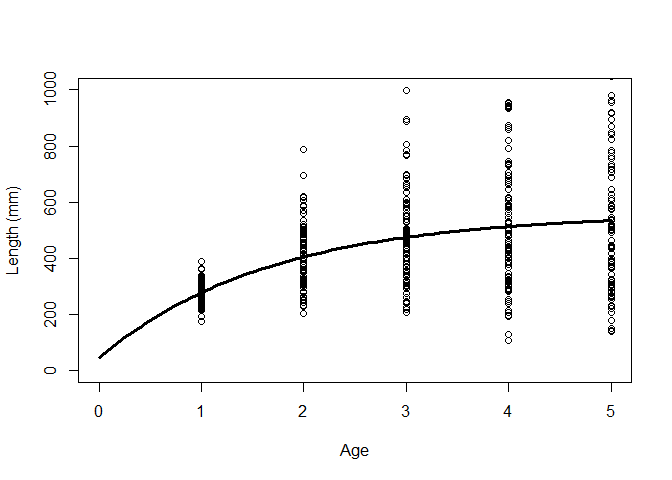

    curve(VB2(x, deterministic = TRUE), xlim = c(0,5), ylim = c(0,1000),
          ylab = "Length (mm)", xlab = "Age", lwd = 3)
    for(i in 1:100){
      points(1,VB2(1))
      points(2,VB2(2))
      points(3,VB2(3))
      points(4,VB2(4))
      points(5,VB2(5))
    }

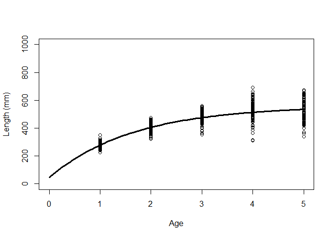

#### 加法誤差 vs 乗法誤差 ??

成長モデル界隈ではどっちの誤差構造を仮定することが多いのか??

-   乗法誤差
    -   体長は非負だから理論的に正しい
    -   分散が確率変数依存の場合、補正式が変わる
-   加法誤差
    -   割と常識的な値のぶれ方を再現できる（大きくずれすぎない）
    -   思った以上に非負に行かない

#### 最大ビン幅と年齢+グループの設定

    max_length <-700
    max_age <-4

シミュレーション1回の流れ
=========================

資源集団の生成と体長データの生成
--------------------------------

-   なんだが漁獲組成から反映させてしまった
-   適当に指数減少的にしてもいいのかも

<!-- -->

    CAA_true <- c(5000,2500,2500,2300,2000)*5 # 2016年のCAA
    age1_dist <- rnorm(CAA_true[1])+1     # 1歳魚の乱数
    age2_dist <- rnorm(CAA_true[2])+2     # 2歳魚の乱数
    age3_dist <- rnorm(CAA_true[3])+3     # 3歳魚の乱数
    age4_dist <- rnorm(CAA_true[4])+4     # 4歳魚の乱数
    age5_dist <- rnorm(CAA_true[5])+5     # 5歳魚の乱数

    age_vec_true <- c(age1_dist, age2_dist, age3_dist, age4_dist, age5_dist)
    age_vec_true <- age_vec_true[-which(age_vec_true <= 0.5)]

    CAAprob_true <- floor(age_vec_true) %>% table() %>% prop.table() %>% round(digits = 3)

    Sample_true <- data.frame(id = 1:length(age_vec_true), 
                             age = age_vec_true,
                             length = purrr::map(age_vec_true, VB) %>% unlist())

    length_age1 <- Sample_true$length[floor(Sample_true$age)==1]
    length_age4 <- Sample_true$length[floor(Sample_true$age)==4]
    par(mfrow = c(1,2))
    hist(length_age1, xlim = c(0,1500))
    hist(length_age4, xlim = c(0,1500))

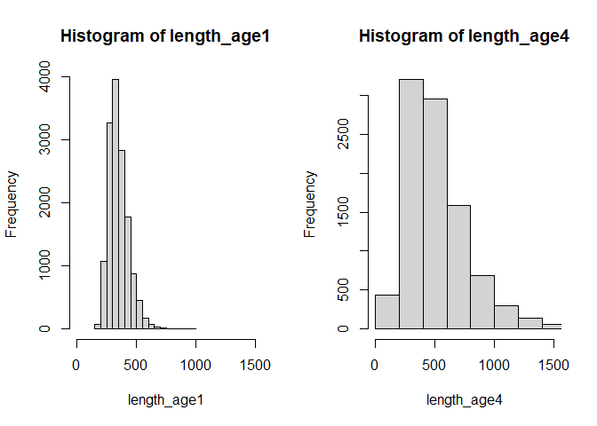

漁獲物の抽出
------------

1.  選択曲線にはダブルロジスティック関数を仮定（延縄なので）

2.  先の資源集団の体長組成にダブルロジスティック関数を当てはめて、各体長の選択率を算出

3.  その選択率をもとに、ベルヌーイ分布で生成

-   0: 漁獲せず
-   1: 漁獲される

<!-- -->

    # double logistic function for selectivity
    double_norm <- function(x, b1=300, b2=0.02, b3=400, b4=0.02){
      (1/(1+exp(-b2*(x-b1)))*(1-(1/(1+exp(-b4*(x-b3))))))/1
    }
    curve(double_norm(x), xlim = c(0,700), ylim=c(0,1))

    # 各体長の選択率に従って、ベルヌーイ分布で0、１で返す
    rBern <- function(ss)sample(x = c(0,1), size = 1, prob = c((1-ss),ss))

    length_tmp2 <- double_norm(Sample_true$length)
    C_0or1 <- numeric()
    for (i in 1:length(length_tmp2)) {
      C_0or1[i] <- rBern(length_tmp2[i])
    }
    Catch_true <- Sample_true[which(C_0or1==1),]

    hist(Catch_true$age)

    prob_Catch_true <- Catch_true$age %>% floor() %>% table()%>% prop.table()
    c(prob_Catch_true[1:4], sum(prob_Catch_true[5:9]))

    ##          0          1          2          3            
    ## 0.07946618 0.34152260 0.23293904 0.15644525 0.18962693

Length frequencyサンプルの抽出
------------------------------

    n_sample1 <- 200
    sample1_true <- sample(1:length(Catch_true$id), n_sample1)

    LF_mat_true <- data.frame(id = Catch_true$id[sample1_true],
                              age = Catch_true$age[sample1_true],
                              length = Catch_true$length[sample1_true]
                              )
    LF_mat_true %<>% mutate(bin_L = lencat(length, w=20))
    LF_mat_true$bin_L[(LF_mat_true$bin_L>=max_length)] <- max_length
    head(LF_mat_true)

    ##      id      age   length bin_L
    ## 1 49257 4.761013 354.1858   340
    ## 2 42098 5.108582 372.3381   360
    ## 3 41153 2.310927 435.0622   420
    ## 4 25613 1.769791 400.8490   400
    ## 5 26204 2.507887 367.9251   360
    ## 6 17873 2.478367 426.4484   420

Age-lengthサブサンプルの抽出
----------------------------

各体長幅ビンから10尾ずつ年齢査定してるんだけど、これって細かいほうが自ずと有利だよね

年齢査定の総尾数は固定したほうがいい？？

目的あってのシミュレーションなわけだし、実際の現場に即している方法を真鍋さんに伺う

    id_tmp <- age_tmp <- length_tmp <- bin_tmp <- NA
    bL_list <- unique(LF_mat_true$bin_L) %>% sort()
    for(bL in 1:length(bL_list)){
      subset_data <- LF_mat_true[LF_mat_true$bin_L==bL_list[bL],]
      if(length(subset_data[,1]) >= 10){
        sample2_label <- sample(1:length(subset_data[,1]), 10) %>% sort()
        id_tmp <- c(id_tmp, subset_data$id[sample2_label])    
        age_tmp <- c(age_tmp, floor(subset_data$age[sample2_label]))
        length_tmp <- c(length_tmp, subset_data$length[sample2_label])
        bin_tmp <- c(bin_tmp, subset_data$bin_L[sample2_label])
      } else {
        id_tmp <- c(id_tmp, subset_data$id)    
        age_tmp <- c(age_tmp, floor(subset_data$age))
        length_tmp <- c(length_tmp, subset_data$length)
        bin_tmp <- c(bin_tmp, subset_data$bin_L)
      }
    }

    plus_tmp <- cbind(age_tmp, rep(NA, length(age_tmp)))
    for (i in 2:length(age_tmp)) {
      plus_tmp[i,2] <- if(plus_tmp[i,1]>=max_age)max_age else plus_tmp[i,1]
    }
    AL_mat <- data.frame(id = na.omit(id_tmp),
                         age = na.omit(plus_tmp[,2]),
                         length = na.omit(length_tmp),
                         bin_L = na.omit(bin_tmp))

    table(AL_mat$bin_L)

    ## 
    ## 120 180 200 220 240 260 280 300 320 340 360 380 400 420 440 460 480 500 520 560 
    ##   1   2   3   6   8  10  10  10  10  10  10  10  10  10   8   3   2   2   1   1

ALKの計算
---------

    ALK_freq <- xtabs(~bin_L + age, data = AL_mat)
    ALK_est <- prop.table(ALK_freq, margin = 1)
    alkPlot(ALK_est, type = "area", pal = "gray", showLegend = TRUE,
            leg.cex = .7, xlab = "Total Length(mm)")

    alkPlot(ALK_est, type = "bubble", pal = "gray", showLegend = TRUE,
            leg.cex = .7, xlab = "Total Length(mm)")

    length_n <- xtabs(~bin_L, data = LF_mat_true)
    alkAgeDist(ALK_est, lenA.n = rowSums(ALK_freq), len.n = length_n)

    ##   age   prop         se
    ## 1   0 0.0820 0.02420093
    ## 2   1 0.3595 0.04829055
    ## 3   2 0.2430 0.04386347
    ## 4   3 0.1380 0.03532435
    ## 5   4 0.1775 0.03741836

ざっとこんな感じです

ビン幅を変えての計算とその結果（VB: 乗法誤差バージョン）
========================================================

    bin_sim <- seq(10,100,10)
    age_label <- c(0,1,2,3,"4+") %>% as.character()
    iteration <- 100
    n_sample1 <- 200
    res_ALKest <- res_ALKse <- LF_mat_sim <- AL_mat_sim <- list()
    est_mat <- se_mat <- matrix(NA, ncol = 5, nrow = iteration)

    for(bb in 1:length(bin_sim)){
      for (ite in 1:iteration) {
        sample1_true <- sample(1:length(Catch_true$id), n_sample1)
      
        ## length frequency sample ----------------------------- ##
        LF_mat_true <- data.frame(id = Catch_true$id[sample1_true],
                                  age = Catch_true$age[sample1_true],
                                  length = Catch_true$length[sample1_true]
        )
        LF_mat_true %<>% mutate(bin_L = lencat(length, w=bin_sim[bb]))
        LF_mat_true$bin_L[(LF_mat_true$bin_L>=max_length)] <- max_length
        
        ## age-length sample ----------------------------- ##
        id_tmp <- age_tmp <- length_tmp <- bin_tmp <- NA
        bL_list <- unique(LF_mat_true$bin_L) %>% sort()
        for(bL in 1:length(bL_list)){
          subset_data <- LF_mat_true[LF_mat_true$bin_L==bL_list[bL],]
          if(length(subset_data[,1]) >= 10){
            sample2_label <- sample(1:length(subset_data[,1]), 10) %>% sort()
            id_tmp <- c(id_tmp, subset_data$id[sample2_label])    
            age_tmp <- c(age_tmp, floor(subset_data$age[sample2_label]))
            length_tmp <- c(length_tmp, subset_data$length[sample2_label])
            bin_tmp <- c(bin_tmp, subset_data$bin_L[sample2_label])
          } else {
            id_tmp <- c(id_tmp, subset_data$id)    
            age_tmp <- c(age_tmp, floor(subset_data$age))
            length_tmp <- c(length_tmp, subset_data$length)
            bin_tmp <- c(bin_tmp, subset_data$bin_L)
          }
        }
        plus_tmp <- cbind(age_tmp, rep(NA, length(age_tmp)))
        for (pp in 2:length(age_tmp)) {
          plus_tmp[pp,2] <- if(plus_tmp[pp,1]>=max_age)max_age else plus_tmp[pp,1]
        }
        AL_mat <- data.frame(id = na.omit(id_tmp),
                             age = na.omit(plus_tmp[,2])+1,
                             length = na.omit(length_tmp),
                             bin_L = na.omit(bin_tmp))
        
        ## calculation ALK
        ALK_freq <- xtabs(~bin_L + age, data = AL_mat)
        ALK_est <- prop.table(ALK_freq, margin = 1)
        length_n <- xtabs(~bin_L, data = LF_mat_true)
        res_ALK <- alkAgeDist(ALK_est, lenA.n = rowSums(ALK_freq), len.n = length_n)
        
        if(!length(res_ALK$prop)==5){
          est_mat[ite,] <- c(rep(0, (5-length(res_ALK$prop))), res_ALK$prop)  ## ここでは０歳魚の選択率が             ##
          se_mat[ite,] <- c(rep(0, (5-length(res_ALK$prop))), res_ALK$se)     ## 明らかに低いから、この項が入っている ##
        } else {
          est_mat[ite,] <- res_ALK$prop
          se_mat[ite,] <- res_ALK$se
        }
        
        ## back-up of samples
        LF_mat_sim[[(ite-1)*10+bb]] <- LF_mat_true
        AL_mat_sim[[(ite-1)*10+bb]] <- AL_mat
      }#for(ite)
      colnames(est_mat) <- colnames(se_mat) <- age_label
      res_ALKest[[bb]] <- est_mat
      res_ALKse[[bb]] <- se_mat
    }#for(bb)

結果
----

バイアスというより、ばらつきが大きくなる感じ

Relative errorで見るとかなり優秀

    par(oma=c(0,0,3,0), mfrow=c(1,2))
    tt <- c(prob_Catch_true[1:4], sum(prob_Catch_true[5:9]))
    for(i in 1:10){
      title_tmp <- paste0("Bin=",bin_sim[i]," (", round(bin_sim[i]/L_inf_true, digits = 3),"*L_inf)")
      boxplot(res_ALKest[[i]], main = "Estimates", ylab = "Prob.")
      points(1:5, c(prob_Catch_true[1:4], sum(prob_Catch_true[5:9])), col="red", pch=16, cex=1.6)
      relative_bias <- apply(res_ALKest[[i]], 1, function(x){(x-tt)/tt})
      boxplot(t(relative_bias), main = "Relative error")
      abline(h = 0, lwd = 1.5, col = "red")

      mtext(side = 3, line=1, outer=T, text = title_tmp, cex=2)
    }

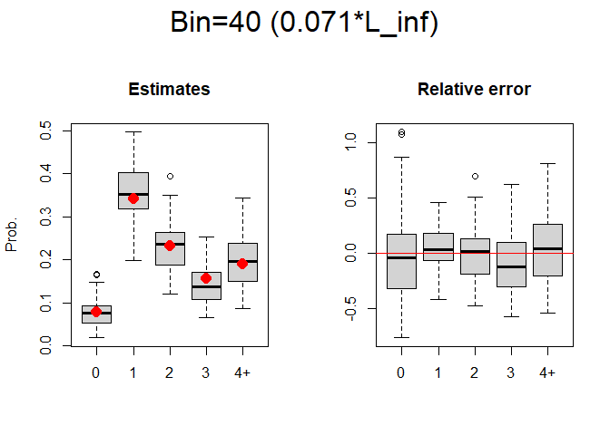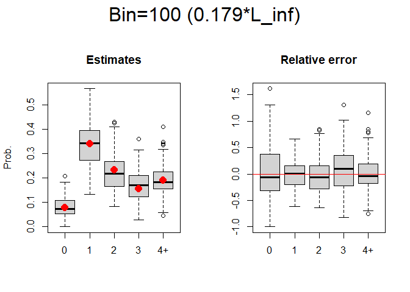

ビン幅を変えての計算（VB2: 加法誤差バージョン）
===============================================

資源集団の生成と体長データの生成
--------------------------------

`Sample_true`からずらず（体長の乱数生成の箇所）。 年齢組成は変わらず。

    Sample_true <- data.frame(id = 1:length(age_vec_true), 
                             age = age_vec_true,
                             length = purrr::map(age_vec_true, VB2) %>% unlist())

    length_age1 <- Sample_true$length[floor(Sample_true$age)==1]
    length_age4 <- Sample_true$length[floor(Sample_true$age)==4]
    par(mfrow = c(1,2))
    hist(length_age1, xlim = c(0,800))
    hist(length_age4, xlim = c(0,800))

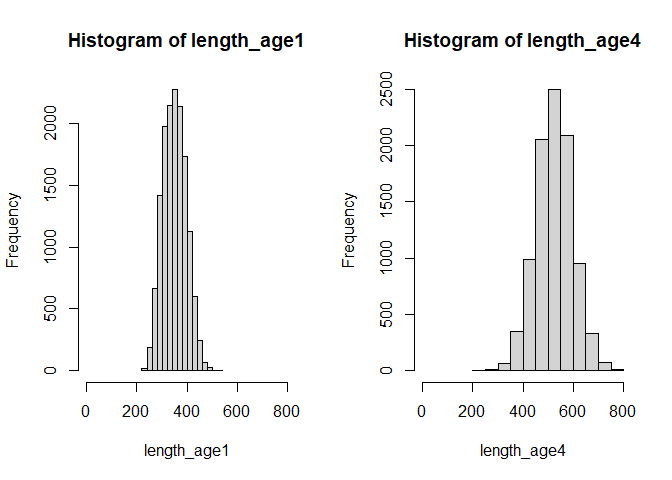

漁獲物の抽出
------------

選択曲線にはダブルロジスティック関数を仮定（延縄なので）

    # double logistic function for selectivity
    double_norm <- function(x, b1=300, b2=0.02, b3=400, b4=0.02){
      (1/(1+exp(-b2*(x-b1)))*(1-(1/(1+exp(-b4*(x-b3))))))/1
    }
    curve(double_norm(x), xlim = c(0,700), ylim=c(0,1))

    # 各体長の選択率に従って、ベルヌーイ分布で0、１で返す
    rBern <- function(ss)sample(x = c(0,1), size = 1, prob = c((1-ss),ss))

    length_tmp2 <- double_norm(Sample_true$length)
    C_0or1 <- numeric()
    for (i in 1:length(length_tmp2)) {
      C_0or1[i] <- rBern(length_tmp2[i])
    }
    Catch_true <- Sample_true[which(C_0or1==1),]

    par(mfrow=c(1,2))
    hist(Catch_true$age)
    hist(Catch_true$length)

    prob_Catch_true <- Catch_true$age %>% floor() %>% table()%>% prop.table()
    c(prob_Catch_true[1:4], sum(prob_Catch_true[5:9]))

    ##          0          1          2          3            
    ## 0.08350432 0.42243363 0.24877200 0.12385749 0.12143257

    bin_sim <- seq(10,100,10)
    age_label <- c(0,1,2,3,"4+") %>% as.character()
    iteration <- 100
    n_sample1 <- 200
    res_ALKest <- res_ALKse <- LF_mat_sim <- AL_mat_sim <- list()
    est_mat <- se_mat <- matrix(NA, ncol = 5, nrow = iteration)

    for(bb in 1:length(bin_sim)){
      for (ite in 1:iteration) {
        sample1_true <- sample(1:length(Catch_true$id), n_sample1)
      
        ## length frequency sample ----------------------------- ##
        LF_mat_true <- data.frame(id = Catch_true$id[sample1_true],
                                  age = Catch_true$age[sample1_true],
                                  length = Catch_true$length[sample1_true]
        )
        LF_mat_true %<>% mutate(bin_L = lencat(length, w=bin_sim[bb]))
        LF_mat_true$bin_L[(LF_mat_true$bin_L>=max_length)] <- max_length
        
        ## age-length sample ----------------------------- ##
        id_tmp <- age_tmp <- length_tmp <- bin_tmp <- NA
        bL_list <- unique(LF_mat_true$bin_L) %>% sort()
        for(bL in 1:length(bL_list)){
          subset_data <- LF_mat_true[LF_mat_true$bin_L==bL_list[bL],]
          if(length(subset_data[,1]) >= 10){
            sample2_label <- sample(1:length(subset_data[,1]), 10) %>% sort()
            id_tmp <- c(id_tmp, subset_data$id[sample2_label])    
            age_tmp <- c(age_tmp, floor(subset_data$age[sample2_label]))
            length_tmp <- c(length_tmp, subset_data$length[sample2_label])
            bin_tmp <- c(bin_tmp, subset_data$bin_L[sample2_label])
          } else {
            id_tmp <- c(id_tmp, subset_data$id)    
            age_tmp <- c(age_tmp, floor(subset_data$age))
            length_tmp <- c(length_tmp, subset_data$length)
            bin_tmp <- c(bin_tmp, subset_data$bin_L)
          }
        }
        plus_tmp <- cbind(age_tmp, rep(NA, length(age_tmp)))
        for (pp in 2:length(age_tmp)) {
          plus_tmp[pp,2] <- if(plus_tmp[pp,1]>=max_age)max_age else plus_tmp[pp,1]
        }
        AL_mat <- data.frame(id = na.omit(id_tmp),
                             age = na.omit(plus_tmp[,2])+1,
                             length = na.omit(length_tmp),
                             bin_L = na.omit(bin_tmp))
        
        ## calculation ALK
        ALK_freq <- xtabs(~bin_L + age, data = AL_mat)
        ALK_est <- prop.table(ALK_freq, margin = 1)
        length_n <- xtabs(~bin_L, data = LF_mat_true)
        res_ALK <- alkAgeDist(ALK_est, lenA.n = rowSums(ALK_freq), len.n = length_n)
        
        if(!length(res_ALK$prop)==5){
          est_mat[ite,] <- c(rep(0, (5-length(res_ALK$prop))), res_ALK$prop)  ## ここでは０歳魚の選択率が             ##
          se_mat[ite,] <- c(rep(0, (5-length(res_ALK$prop))), res_ALK$se)     ## 明らかに低いから、この項が入っている ##
        } else {
          est_mat[ite,] <- res_ALK$prop
          se_mat[ite,] <- res_ALK$se
        }
        
        ## back-up of samples
        LF_mat_sim[[(ite-1)*10+bb]] <- LF_mat_true
        AL_mat_sim[[(ite-1)*10+bb]] <- AL_mat
      }#for(ite)
      colnames(est_mat) <- colnames(se_mat) <- age_label
      res_ALKest[[bb]] <- est_mat
      res_ALKse[[bb]] <- se_mat
    }#for(bb)

    par(oma=c(0,0,3,0), mfrow=c(1,2))
    tt <- c(prob_Catch_true[1:4], sum(prob_Catch_true[5:9]))
    for(i in 1:10){
      title_tmp <- paste0("Bin=",bin_sim[i]," (", round(bin_sim[i]/L_inf_true, digits = 3),"*L_inf)")
      boxplot(res_ALKest[[i]], main = "Estimates", ylab = "Prob.")
      points(1:5, c(prob_Catch_true[1:4], sum(prob_Catch_true[5:9])), col="red", pch=16, cex=1.6)
      relative_bias <- apply(res_ALKest[[i]], 1, function(x){(x-tt)/tt})
      boxplot(t(relative_bias), main = "Relative error")
      abline(h = 0, lwd = 1.5, col = "red")

      mtext(side = 3, line=1, outer=T, text = title_tmp, cex=2)
    }

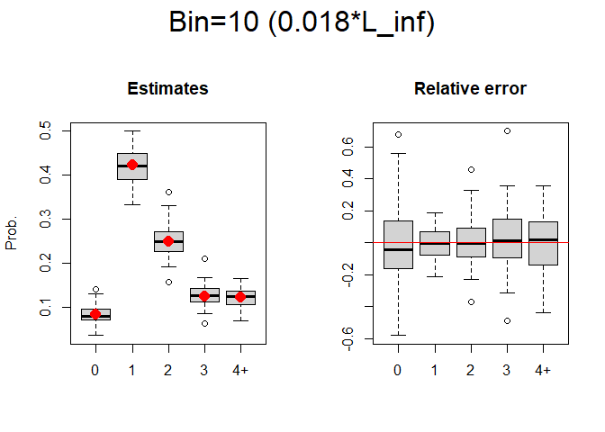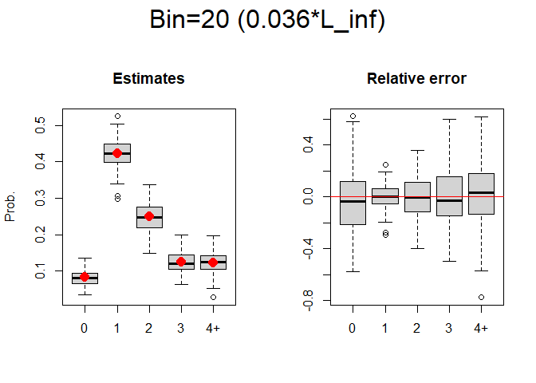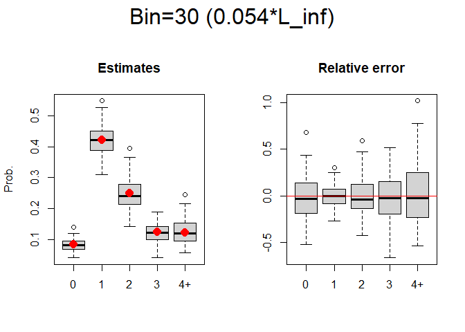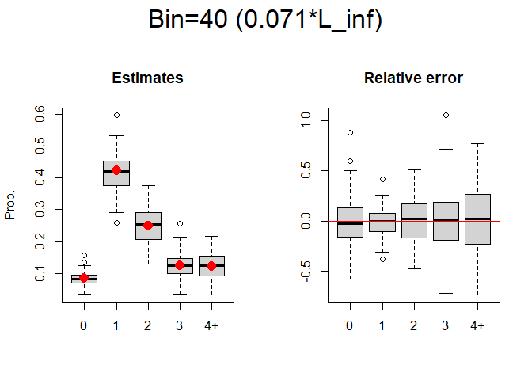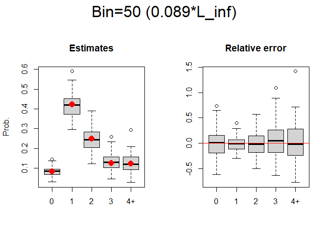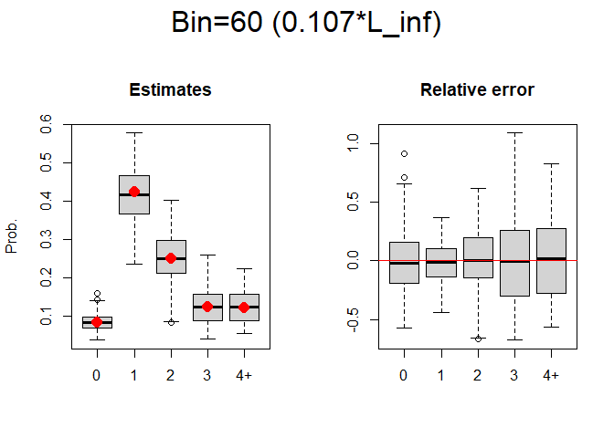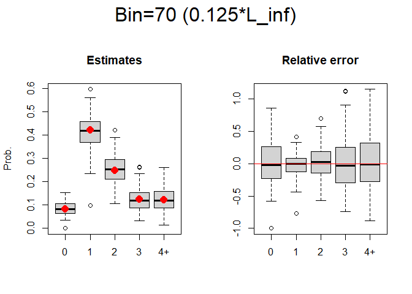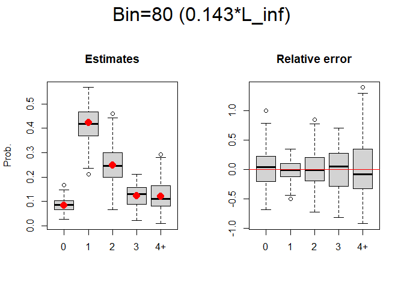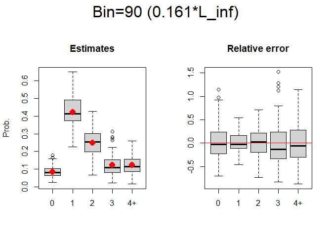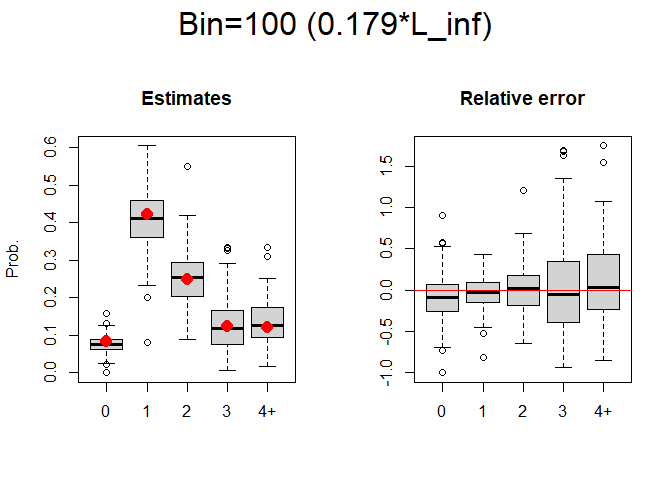

ランダムにAge-lengthサブサンプルの抽出（VB2: 加法誤差バージョン）
=================================================================

意図として、

-   ビン幅狭: 精度は高いけど、ALK計算できないパターンの出現
-   ビン幅広:
    精度は低いけど、周辺のビンサイズとマスクし合ってALK計算出来る

この2者のトレードオフを見よう

    bin_sim <- seq(10,100,10)
    age_label <- c(0,1,2,3,"4+") %>% as.character()
    iteration <- 100
    n_sample1 <- 200
    n_sample2 <- 100
    res_ALKest <- res_ALKse <- LF_mat_sim <- AL_mat_sim <- list()
    est_mat <- se_mat <- matrix(NA, ncol = 5, nrow = iteration)

    for(bb in 1:length(bin_sim)){
      for (ite in 1:iteration) {
        sample1_true <- sample(1:length(Catch_true$id), n_sample1)
      
        ## length frequency sample ----------------------------- ##
        LF_mat_true <- data.frame(id = Catch_true$id[sample1_true],
                                  age = Catch_true$age[sample1_true],
                                  length = Catch_true$length[sample1_true]
        )
        LF_mat_true %<>% mutate(bin_L = lencat(length, w=bin_sim[bb]))
        LF_mat_true$bin_L[(LF_mat_true$bin_L>=max_length)] <- max_length
        
        ## age-length sample ----------------------------- ##
        id_tmp <- sample(1:length(LF_mat_true$id), n_sample2) %>% sort()
        age_tmp <- LF_mat_true$age[id_tmp]
        plus_tmp <- cbind(age_tmp, rep(NA, length(age_tmp)))
        for (pp in 1:length(age_tmp)) {
          plus_tmp[pp,2] <- if(plus_tmp[pp,1]>=max_age)max_age else plus_tmp[pp,1]
        }
        AL_mat <- data.frame(id = id_tmp,
                             age = floor(plus_tmp[,2])+1,
                             length = LF_mat_true$length[id_tmp],
                             bin_L = LF_mat_true$bin_L[id_tmp])
        
        ## calculation ALK
        ALK_freq <- xtabs(~bin_L + age, data = AL_mat)
        ALK_est <- prop.table(ALK_freq, margin = 1)
        length_n <- xtabs(~bin_L, data = LF_mat_true)
        res_ALK <- alkAgeDist(ALK_est, lenA.n = rowSums(ALK_freq), len.n = length_n) %>% try(silent = TRUE)
        
        if(class(res_ALK) == "try-error"){
          est_mat[ite,] <- NA
          se_mat[ite,] <- NA
        } else {
          if(!length(res_ALK$prop)==5){
            est_mat[ite,] <- c(rep(0, (5-length(res_ALK$prop))), res_ALK$prop)  
            se_mat[ite,] <- c(rep(0, (5-length(res_ALK$prop))), res_ALK$se)     
          } else {
            est_mat[ite,] <- res_ALK$prop
            se_mat[ite,] <- res_ALK$se
          }  
        }
        
        ## back-up of samples
        LF_mat_sim[[(ite-1)*length(bin_sim)+bb]] <- LF_mat_true
        AL_mat_sim[[(ite-1)*length(bin_sim)+bb]] <- AL_mat
      }#for(ite)
      colnames(est_mat) <- colnames(se_mat) <- age_label
      res_ALKest[[bb]] <- est_mat
      res_ALKse[[bb]] <- se_mat
    }#for(bb)

    par(oma=c(0,0,3,0), mfrow=c(1,2))
    tt <- c(prob_Catch_true[1:4], sum(prob_Catch_true[5:9]))
    for(i in 1:10){
      if(sum(is.na(res_ALKest[[i]])) == length(bin_sim)*length(age_label))break
      title_tmp <- paste0("Bin=",bin_sim[i]," (", round(bin_sim[i]/L_inf_true, digits = 3),"*L_inf)")
      boxplot(res_ALKest[[i]], main = "Estimates", ylab = "Prob.")
      points(1:5, c(prob_Catch_true[1:4], sum(prob_Catch_true[5:9])), col="red", pch=16, cex=1.6)
      relative_bias <- apply(res_ALKest[[i]], 1, function(x){(x-tt)/tt})
      boxplot(t(relative_bias), main = "Relative error")
      abline(h = 0, lwd = 1.5, col = "red")

      mtext(side = 3, line=1, outer=T, text = title_tmp, cex=2)
    }

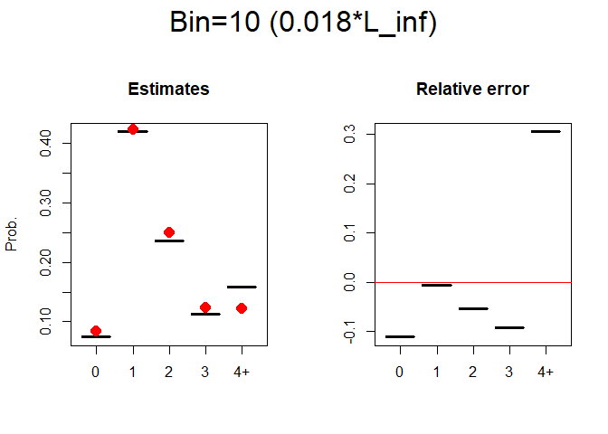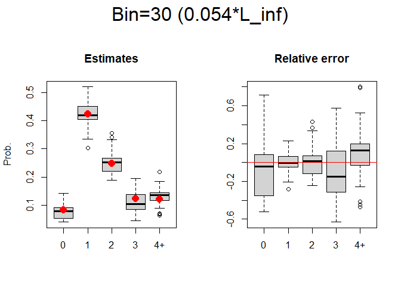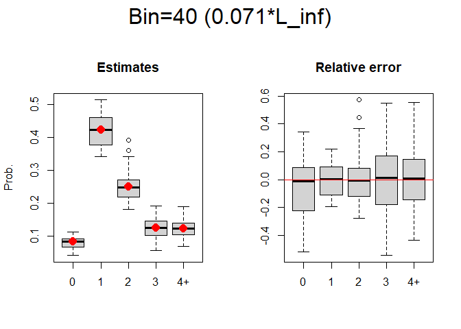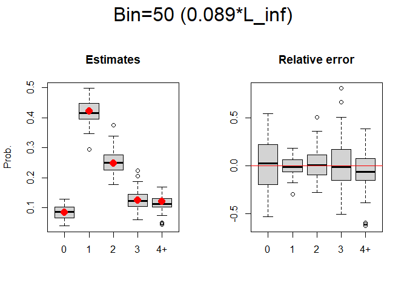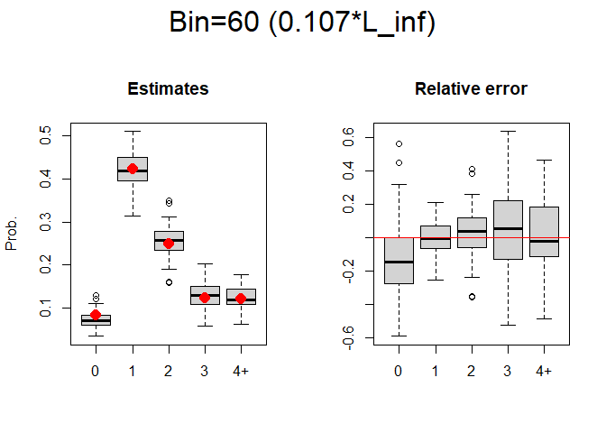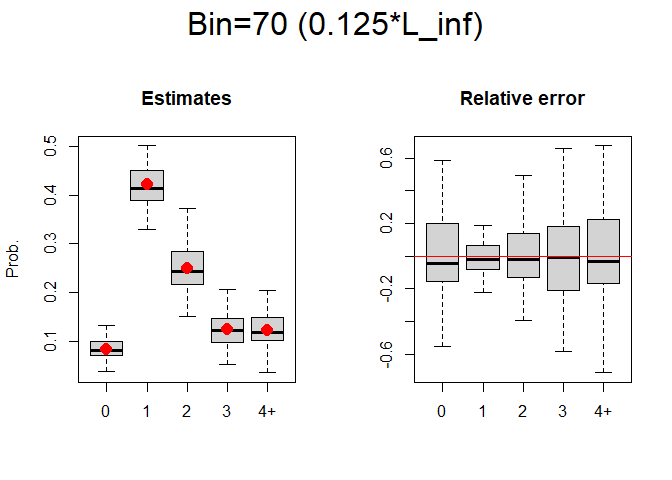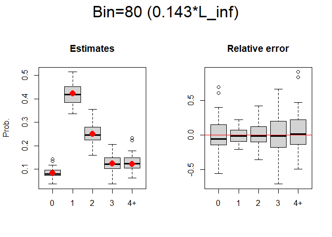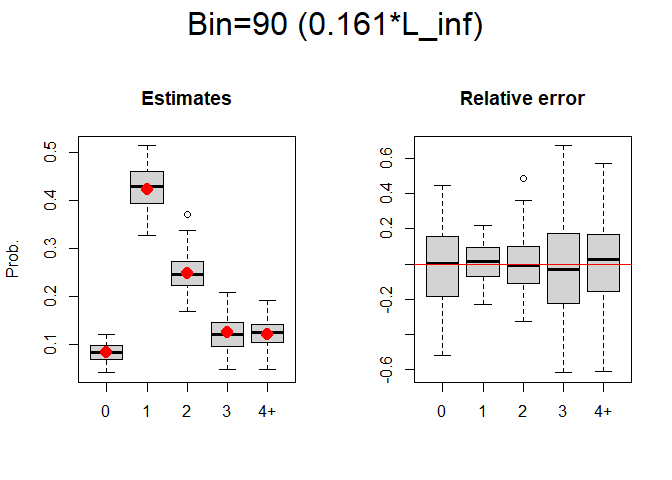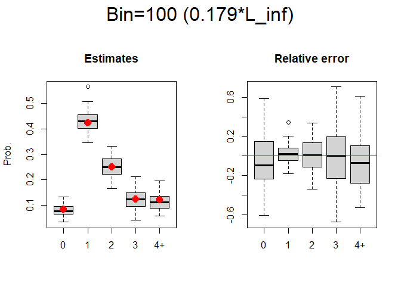

age propertiesの推定可能割合
----------------------------

    ageprop <- numeric()
    for(i in 1:10)ageprop[i] <- (500 - (is.na(res_ALKest[[i]]) %>% sum())) /500
    ageprop <- as.data.frame(ageprop) %>% t()
    colnames(ageprop) <- bin_sim
    knitr::kable(ageprop)

<table>
<thead>
<tr class="header">
<th style="text-align: left;"></th>
<th style="text-align: right;">10</th>
<th style="text-align: right;">20</th>
<th style="text-align: right;">30</th>
<th style="text-align: right;">40</th>
<th style="text-align: right;">50</th>
<th style="text-align: right;">60</th>
<th style="text-align: right;">70</th>
<th style="text-align: right;">80</th>
<th style="text-align: right;">90</th>
<th style="text-align: right;">100</th>
</tr>
</thead>
<tbody>
<tr class="odd">
<td style="text-align: left;">ageprop</td>
<td style="text-align: right;">0.01</td>
<td style="text-align: right;">0.11</td>
<td style="text-align: right;">0.26</td>
<td style="text-align: right;">0.38</td>
<td style="text-align: right;">0.43</td>
<td style="text-align: right;">0.58</td>
<td style="text-align: right;">0.51</td>
<td style="text-align: right;">0.68</td>
<td style="text-align: right;">0.68</td>
<td style="text-align: right;">0.66</td>
</tr>
</tbody>
</table>

メモ
====

目的を見失っていないかチェック なんのためのシミュレーションなのか

漁獲の箇所も乱数にした方がいいかも（選択率かけるところ）

実際のバイアス要因を考える（相対誤差が優秀すぎる） -
測定誤差（体長・年齢） -
サンプリング数（Age-lengthサブサンプルとかビン依存のわりに出来すぎてる）
- 後なんだろ…

現実に即しているようにもっと勉強する

シミュレーションで自動的に計算するのと、データ見てビン幅とか調整していくのは割と解析上の相性が悪い
