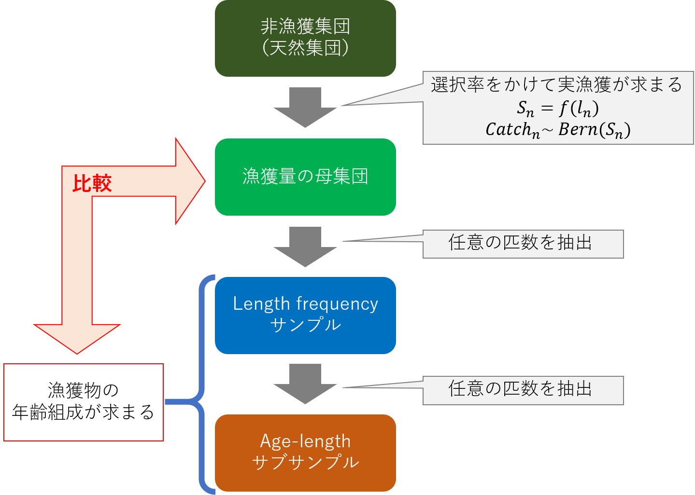
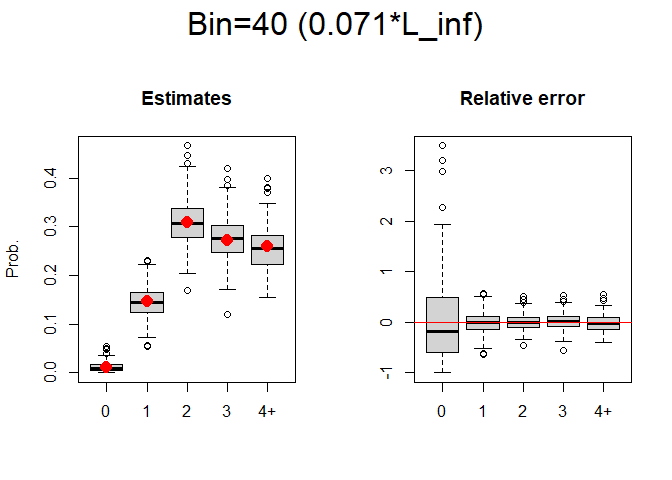
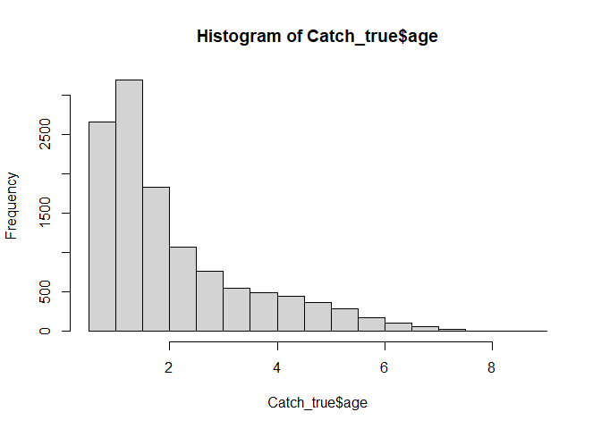

-   [目的](#目的)
    -   [本MDファイルの目的](#本mdファイルの目的)
-   [解析の流れ](#解析の流れ)
-   [成長モデル（von Bertalanffy）](#成長モデルvon-bertalanffy)
    -   [最大ビン幅と年齢+グループの設定](#最大ビン幅と年齢グループの設定)
    -   [資源集団の生成と体長データの生成](#資源集団の生成と体長データの生成)
    -   [必要な関数の定義](#必要な関数の定義)
-   [解析](#解析)
    -   [K = 0.3](#k-0.3)
    -   [age propertiesの推定可能割合](#age-propertiesの推定可能割合)
    -   [K = 0.6](#k-0.6)
    -   [K = 0.9](#k-0.9)
    -   [まとめ](#まとめ)

目的
====

-   ALKを得る際に、どのくらいの体長ビン幅が推定上最適なのか知ること
    -   (正直、細かければ細かいほうがいいという辺りだとは思う)
    -   例えばCV10%で推定結果を得るには?みたいにするのがベターかな
-   成長関数の各パラメータの値と最適ビン幅の関係の把握
    -   L\_infの10%体長とかそんな風に得られたら面白いかな

本MDファイルの目的
------------------

-   成長モデルのパラメータKの値を変える
-   その場合の最適ビンサイズの違いを考える

解析の流れ
==========

1.  5万匹くらいの資源の全体を設定

2.  年齢データがあるから、体長に変換する

3.  体長についての選択曲線から漁獲物を抽出(上手いアイデアなかったのでとりあえず300-500mmをランダム抽出)

4.  1万匹の漁獲サンプルからlength frequencyサンプル200を抽出

5.  さらに各体長ビンから10尾ずつ年齢査定をしてALKの計算

6.  4と5を繰り返してシミュレーション

成長モデル（von Bertalanffy）
=============================

ベースはトラフグ瀬戸内系群を参考にしてみた。

加法誤差モデルの`VB2`を使っている

    L_inf_true <- 560
    K_true_vec <- seq(0.3, 0.9, 0.05)
    a0_true <- -0.144

    VB2 <- function(x, L_inf=L_inf_true, K=K_true, a0=a0_true, 
                   a_sd=5, b_sd=15, deterministic = FALSE){
      if(isTRUE(deterministic)){
        L_inf*(1-exp(-K*(x-a0)))
      } else {
        sd <- a_sd + b_sd*x
        L_inf*(1-exp(-K*(x-a0)))+rnorm(1, 0, sd)
      }
    }

    curve(VB2(x, K = K_true_vec[7], deterministic = TRUE), xlim = c(0,5), ylim = c(0,1000),
          ylab = "Length (mm)", xlab = "Age", lwd = 3)
    par(new=T)
    curve(VB2(x, K = K_true_vec[1], deterministic = TRUE), xlim = c(0,5), ylim = c(0,1000),
          ylab = "Length (mm)", xlab = "Age", lwd = 3, lty = 2, col = "blue")
    par(new=T)
    curve(VB2(x, K = K_true_vec[13], deterministic = TRUE), xlim = c(0,5), ylim = c(0,1000),
          ylab = "Length (mm)", xlab = "Age", lwd = 3, lty = 3, col = "red")
    for(i in 1:100){
      points(1,VB2(1, K = K_true_vec[7]))
      points(2,VB2(2, K = K_true_vec[7]))
      points(3,VB2(3, K = K_true_vec[7]))
      points(4,VB2(4, K = K_true_vec[7]))
      points(5,VB2(5, K = K_true_vec[7]))
    }
    legend("topleft", legend = c("K=0.3","K=0.6","K=0.9"), lty = c(2,1,3),
           col = c("blue", "black", "red"))

#### 最大ビン幅と年齢+グループの設定

    max_length <-700
    max_age <-4

資源集団の生成と体長データの生成
--------------------------------

-   なんだが漁獲組成から反映させてしまった
-   適当に指数減少的にしてもいいのかも

<!-- -->

    CAA_true <- c(5000,2500,2500,2300,2000)*5 # 2016年のCAA
    age1_dist <- rnorm(CAA_true[1])+1     # 1歳魚の乱数
    age2_dist <- rnorm(CAA_true[2])+2     # 2歳魚の乱数
    age3_dist <- rnorm(CAA_true[3])+3     # 3歳魚の乱数
    age4_dist <- rnorm(CAA_true[4])+4     # 4歳魚の乱数
    age5_dist <- rnorm(CAA_true[5])+5     # 5歳魚の乱数

    age_vec_true <- c(age1_dist, age2_dist, age3_dist, age4_dist, age5_dist)
    age_vec_true <- age_vec_true[-which(age_vec_true <= 0.5)]

    (CAAprob_true <- floor(age_vec_true) %>% table() %>% prop.table() %>% round(digits = 3))

    ## .
    ##     0     1     2     3     4     5     6     7     8 
    ## 0.097 0.236 0.220 0.186 0.148 0.084 0.026 0.004 0.000

    Sample_true <- list()
    for(i in 1:length(K_true_vec)){
      K_true <- K_true_vec[i]
      Sample_true[[i]] <- data.frame(id = 1:length(age_vec_true), 
                                     age = age_vec_true,
                                     length = purrr::map(age_vec_true, VB2) %>% unlist())
    }

    # K=0.3
    length_age1 <- Sample_true[[1]]$length[floor(Sample_true[[1]]$age)==1]
    length_age4 <- Sample_true[[1]]$length[floor(Sample_true[[1]]$age)==4]
    par(mfrow = c(1,2), oma = c(0,0,3,0))
    hist(length_age1, xlim = c(0,1000))
    hist(length_age4, xlim = c(0,1000))
    mtext(side = 3, line=1, outer=T, text = "K = 0.3", cex=2)

    # K=0.6
    length_age1 <- Sample_true[[7]]$length[floor(Sample_true[[7]]$age)==1]
    length_age4 <- Sample_true[[7]]$length[floor(Sample_true[[7]]$age)==4]
    par(mfrow = c(1,2), oma = c(0,0,3,0))
    hist(length_age1, xlim = c(0,1000))
    hist(length_age4, xlim = c(0,1000))
    mtext(side = 3, line=1, outer=T, text = "K = 0.6", cex=2)

必要な関数の定義
----------------

    # double logistic function for selectivity
    double_norm <- function(x, b1=300, b2=0.02, b3=400, b4=0.02){
      (1/(1+exp(-b2*(x-b1)))*(1-(1/(1+exp(-b4*(x-b3))))))/1 
    }

    # 各体長の選択率に従って、ベルヌーイ分布で0、１で返す
    rBern <- function(ss)sample(x = c(0,1), size = 1, prob = c((1-ss),ss))

解析
====

以下3点が、for文でシミュレーションされる

-   選択曲線による漁獲物の抽出
-   length frequencyサンプルの抽出
-   age-lengthサブサンプルの抽出

<!-- -->

    bin_sim <- seq(10,100,10)
    age_label <- c(0,1,2,3,"4+") %>% as.character()
    iteration <- 1000
    n_sample1 <- 200
    n_sample2 <- 100

K = 0.3
-------

    n_K <- 1

    length_tmp2 <- double_norm(Sample_true[[n_K]]$length)
    C_0or1 <- numeric()
    for (i in 1:length(length_tmp2)) {
      C_0or1[i] <- rBern(length_tmp2[i])
    }
    Catch_true <- Sample_true[[n_K]][which(C_0or1==1),]

    hist(Catch_true$age)

    prob_Catch_true <- Catch_true$age %>% floor() %>% table()%>% prop.table()
    c(prob_Catch_true[1:4], sum(prob_Catch_true[5:length(prob_Catch_true)]))

    ##          0          1          2          3            
    ## 0.01223175 0.14667176 0.30934309 0.27275706 0.25899634

    res_ALKest <- res_ALKse <- LF_mat_sim <- AL_mat_sim <- list()
    est_mat <- se_mat <- matrix(NA, ncol = 5, nrow = iteration)

    for(bb in 1:length(bin_sim)){
      for (ite in 1:iteration) {
        sample1_true <- sample(1:length(Catch_true$id), n_sample1)
      
        ## length frequency sample ----------------------------- ##
        LF_mat_true <- data.frame(id = Catch_true$id[sample1_true],
                                  age = Catch_true$age[sample1_true],
                                  length = Catch_true$length[sample1_true]
        )
        LF_mat_true %<>% mutate(bin_L = lencat(length, w=bin_sim[bb]))
        LF_mat_true$bin_L[(LF_mat_true$bin_L>=max_length)] <- max_length
        
        ## age-length sample ----------------------------- ##
        id_tmp <- sample(1:length(LF_mat_true$id), n_sample2) %>% sort()
        age_tmp <- LF_mat_true$age[id_tmp]
        plus_tmp <- cbind(age_tmp, rep(NA, length(age_tmp)))
        for (pp in 1:length(age_tmp)) {
          plus_tmp[pp,2] <- if(plus_tmp[pp,1]>=max_age)max_age else plus_tmp[pp,1]
        }
        AL_mat <- data.frame(id = id_tmp,
                             age = floor(plus_tmp[,2])+1,
                             length = LF_mat_true$length[id_tmp],
                             bin_L = LF_mat_true$bin_L[id_tmp])
        
        ## calculation ALK
        ALK_freq <- xtabs(~bin_L + age, data = AL_mat)
        ALK_est <- prop.table(ALK_freq, margin = 1)
        length_n <- xtabs(~bin_L, data = LF_mat_true)
        res_ALK <- try(alkAgeDist(ALK_est, lenA.n = rowSums(ALK_freq), len.n = length_n), silent = TRUE)
        
        if(class(res_ALK) == "try-error"){
          est_mat[ite,] <- NA
          se_mat[ite,] <- NA
        } else {
          if(!length(res_ALK$prop)==5){
            est_mat[ite,] <- c(rep(0, (5-length(res_ALK$prop))), res_ALK$prop)  
            se_mat[ite,] <- c(rep(0, (5-length(res_ALK$prop))), res_ALK$se)     
          } else {
            est_mat[ite,] <- res_ALK$prop
            se_mat[ite,] <- res_ALK$se
          }  
        }
        
        ## back-up of samples
        LF_mat_sim[[(ite-1)*length(bin_sim)+bb]] <- LF_mat_true
        AL_mat_sim[[(ite-1)*length(bin_sim)+bb]] <- AL_mat
        rm(res_ALK)
      }#for(ite)
      
      colnames(est_mat) <- colnames(se_mat) <- age_label
      res_ALKest[[bb]] <- est_mat
      res_ALKse[[bb]] <- se_mat
      
    }#for(bb)

    tt <- c(prob_Catch_true[1:4], sum(prob_Catch_true[5:9]))
    mean_relat <- matrix(NA, ncol = length(tt), nrow = length(bin_sim))
    par(oma=c(0,0,3,0), mfrow=c(1,2))
    for(i in 1:10){
      if(sum(is.na(res_ALKest[[i]])) == iteration*length(age_label))next
      title_tmp <- paste0("Bin=",bin_sim[i]," (", round(bin_sim[i]/L_inf_true, digits = 3),"*L_inf)")
      boxplot(res_ALKest[[i]], main = "Estimates", ylab = "Prob.")
      points(1:5, c(prob_Catch_true[1:4], sum(prob_Catch_true[5:9])), col="red", pch=16, cex=1.6)
      relative_bias <- apply(res_ALKest[[i]], 1, function(x){(x-tt)/tt})
      boxplot(t(relative_bias), main = "Relative error")
      abline(h = 0, lwd = 1.5, col = "red")
      mtext(side = 3, line=1, outer=T, text = title_tmp, cex=2)
      mean_relat[i,] <- apply(relative_bias, 1, function(x)mean(x, na.rm = T))
    }

age propertiesの推定可能割合
----------------------------

    ageprop_03 <- numeric()
    for(i in 1:10)ageprop_03[i] <- (length(res_ALKest[[i]])-(is.na(res_ALKest[[i]]) %>% sum())) /length(res_ALKest[[i]])
    ageprop_03 <- as.data.frame(ageprop_03) 
    ageprop_03 <- cbind.data.frame(ageprop_03, 
                                age0_relative_error = mean_relat[,1],
                                age1_relative_error = mean_relat[,2],
                                age2_relative_error = mean_relat[,3],
                                age3_relative_error = mean_relat[,4],
                                age4_relative_error = mean_relat[,5],
                                mean_relative_error = apply(mean_relat, 1, function(x)mean(x, na.rm = T)))

K = 0.6
-------

    ##          0          1          2          3            
    ## 0.08179241 0.42326183 0.25382150 0.11939103 0.12173323

    tt <- c(prob_Catch_true[1:4], sum(prob_Catch_true[5:9]))
    mean_relat <- matrix(NA, ncol = length(tt), nrow = length(bin_sim))
    par(oma=c(0,0,3,0), mfrow=c(1,2))
    for(i in 1:10){
      if(sum(is.na(res_ALKest[[i]])) == iteration*length(age_label))next
      title_tmp <- paste0("Bin=",bin_sim[i]," (", round(bin_sim[i]/L_inf_true, digits = 3),"*L_inf)")
      boxplot(res_ALKest[[i]], main = "Estimates", ylab = "Prob.")
      points(1:5, c(prob_Catch_true[1:4], sum(prob_Catch_true[5:9])), col="red", pch=16, cex=1.6)
      relative_bias <- apply(res_ALKest[[i]], 1, function(x){(x-tt)/tt})
      boxplot(t(relative_bias), main = "Relative error")
      abline(h = 0, lwd = 1.5, col = "red")
      mtext(side = 3, line=1, outer=T, text = title_tmp, cex=2)
      mean_relat[i,] <- apply(relative_bias, 1, function(x)mean(x, na.rm = T))
    }

    ageprop_06 <- numeric()
    for(i in 1:10)ageprop_06[i] <- (length(res_ALKest[[i]])-(is.na(res_ALKest[[i]]) %>% sum())) /length(res_ALKest[[i]])
    ageprop_06 <- as.data.frame(ageprop_06) 
    ageprop_06 <- cbind.data.frame(ageprop_06, 
                                age0_relative_error = mean_relat[,1],
                                age1_relative_error = mean_relat[,2],
                                age2_relative_error = mean_relat[,3],
                                age3_relative_error = mean_relat[,4],
                                age4_relative_error = mean_relat[,5],
                                mean_relative_error = apply(mean_relat, 1, function(x)mean(x, na.rm = T)))

K = 0.9
-------

    ##          0          1          2          3            
    ## 0.22108589 0.41664588 0.15232394 0.08622267 0.12372163

    tt <- c(prob_Catch_true[1:4], sum(prob_Catch_true[5:9]))
    mean_relat <- matrix(NA, ncol = length(tt), nrow = length(bin_sim))
    par(oma=c(0,0,3,0), mfrow=c(1,2))
    for(i in 1:10){
      if(sum(is.na(res_ALKest[[i]])) == iteration*length(age_label))next
      title_tmp <- paste0("Bin=",bin_sim[i]," (", round(bin_sim[i]/L_inf_true, digits = 3),"*L_inf)")
      boxplot(res_ALKest[[i]], main = "Estimates", ylab = "Prob.")
      points(1:5, c(prob_Catch_true[1:4], sum(prob_Catch_true[5:9])), col="red", pch=16, cex=1.6)
      relative_bias <- apply(res_ALKest[[i]], 1, function(x){(x-tt)/tt})
      boxplot(t(relative_bias), main = "Relative error")
      abline(h = 0, lwd = 1.5, col = "red")
      mtext(side = 3, line=1, outer=T, text = title_tmp, cex=2)
      mean_relat[i,] <- apply(relative_bias, 1, function(x)mean(x, na.rm = T))
    }

    ageprop_09 <- numeric()
    for(i in 1:10)ageprop_09[i] <- (length(res_ALKest[[i]])-(is.na(res_ALKest[[i]]) %>% sum())) /length(res_ALKest[[i]])
    ageprop_09 <- as.data.frame(ageprop_09) 
    ageprop_09 <- cbind.data.frame(ageprop_09, 
                                age0_relative_error = mean_relat[,1],
                                age1_relative_error = mean_relat[,2],
                                age2_relative_error = mean_relat[,3],
                                age3_relative_error = mean_relat[,4],
                                age4_relative_error = mean_relat[,5],
                                mean_relative_error = apply(mean_relat, 1, function(x)mean(x, na.rm = T)))

まとめ
------

    # K = 0.3
    par(mar=c(4,4,3,4))
    plot(rownames(ageprop_03), ageprop_03$ageprop_03,
         ylim = c(0,1), ylab = "Successful rate", xlab = "Bin length",
         type = "l", lty = 1, col = "red")
    abline(h=0.5, col = "blue", lty=3)
    par(new=T)
    plot(rownames(ageprop_03), ageprop_03$age0_relative_error,
         ylim = c(-1,1), ylab = "", axes = FALSE, xlab = "Bin length",
         lty = 1, col = "blue")
    axis(4) 
    mtext("Relative error of age 0",side = 4, line = 3)
    mtext("K = 0.3",side = 3, line = 1, cex = 2)

    # K = 0.6
    par(mar=c(4,4,3,4))
    plot(rownames(ageprop_06), ageprop_06$ageprop_06,
         ylim = c(0,1), ylab = "Successful rate", xlab = "Bin length",
         type = "l", lty = 1, col = "red")
    abline(h=0.5, col = "blue", lty=3)
    par(new=T)
    plot(rownames(ageprop_06), ageprop_06$age0_relative_error,
         ylim = c(-1,1), ylab = "", axes = FALSE, xlab = "Bin length",
         lty = 1, col = "blue")
    axis(4) 
    mtext("Relative error of age 0",side = 4, line = 3)
    mtext("K = 0.6",side = 3, line = 1, cex = 2)

    # K = 0.9
    par(mar=c(4,4,3,4))
    plot(rownames(ageprop_09), ageprop_09$ageprop_09,
         ylim = c(0,1), ylab = "Successful rate", xlab = "Bin length",
         type = "l", lty = 1, col = "red")
    abline(h=0.5, col = "blue", lty=3)
    par(new=T)
    plot(rownames(ageprop_09), ageprop_09$age0_relative_error,
         ylim = c(-1,1), ylab = "", axes = FALSE, xlab = "Bin length",
         lty = 1, col = "blue")
    axis(4) 
    mtext("Relative error of age 0",side = 4, line = 3)
    mtext("K = 0.9",side = 3, line = 1, cex = 2)

